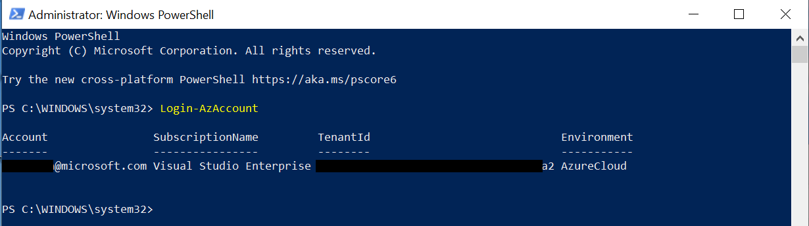
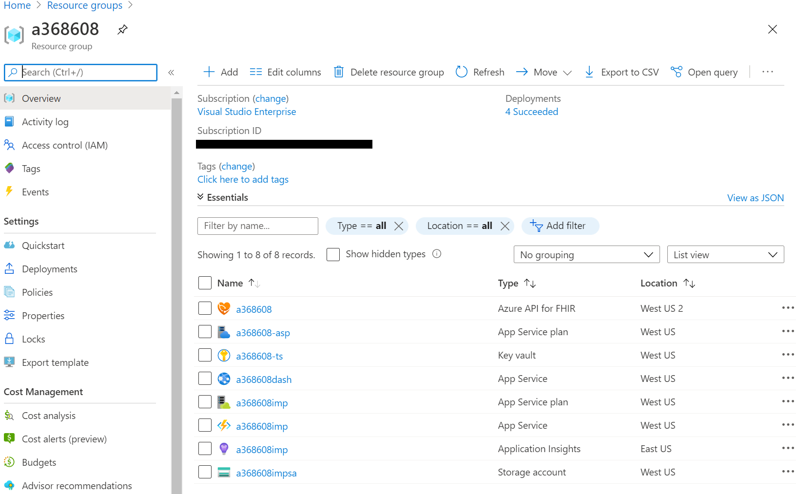
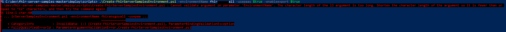
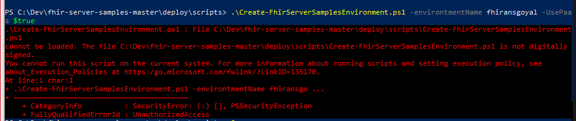
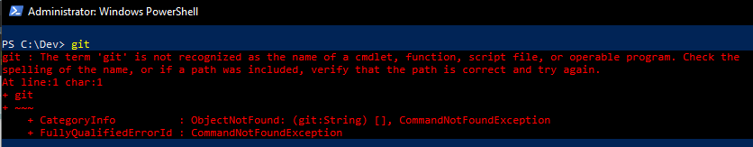

# Challenge01 - Azure API for FHIR

## Scenario
Your team has now learned a little about the FHIR standard. Our first challenge focuses on you as a software developer on the data interoperability team. **Any Healthcare’s** strategic direction is to build new solutions on public cloud resources wherever possible.

The first task has landed on you: In order to learn a bit about the capabilities of Azure’s API for FHIR API, you will set up a development instance. This development instance is designed to highlight the key features, by building a demo-like environment. Once you are done with the setup you will verify the service is functioning by loading some synthetic data. The data is generated using Synthea which allows you to mimic EMR/EHR data. You will then use the dashboard app and run some basic queries to ensure the core functionality is working. 

## Reference Architecture
<center></center>

## To complete this challenge successfully, you will perform the following tasks.

* **Provision Azure API for FHIR API demo environment**. Given the limited time, we'll provide a set of scripts to accomplish this. For step by step instructions, check the appendix.
* **Load Synthetic data**. You can generate the data using Synthea or use a staged dataset that we'll provide.
* **Validate data load**. You can use the dashboard application to validate the data or the provided APIs by using Postman.

## Before you start

Make sure you have completed the pre-work covered in the previous challenge: [Challenge00 - Pre-requisites: Technical and knowledge requirements for completing the Challenges](../Challenge00-Prerequistes/ReadMe.md).

We will use PowerShell to deploy the Azure API for FHIR API demo environment. Using either the Windows PowerShell console or the Windows PowerShell ISE, run the following commands.

```powershell
  Install-Module Az
  Install-Module AzureAd
```  

To verify, log into your Azure account using the following command and follow instructions to authenticate:
```cmd
  Login-AzAccount
```

If everything worked, your output should be similiar to the one below:
<center></center>

You will need access to an Azure tenant that allows your to create and register applications. Most corporate tenants will typically have this disabled. Fortunately it's relatively easy to create new tenants/directories, check the appendix for additional information.

Once you have the right tenant, get the TenantID, your will need it in subsequent steps.

## Getting Started

## Task #1: Provision Azure API for FHIR demo environment.

* ### Get the code
```powershell
  git clone https://github.com/Microsoft/fhir-server-samples
``` 
* ### Connect to your tenant's Azure AD
```powershell
  Connect-AzureAd -TenantDomain <Your TenantID>
``` 
* ### Connect to your tenant's Azure AD
```powershell
  cd fhir-server-samples/deploy/scripts
  .\Create-FhirServerSamplesEnvironment.ps1 -EnvironmentName <ENVIRONMENTNAME> -UsePaaS $true
```
The ENVIRONMENTNAME is a value that you select and will be used as the prefix for the Azure resources that the script deploys, therefore it should be globally unique.

If all goes well, the script will kickoff and will take about 10-15 minutes to complete. If the script throws an error, please check the **Help I'm Stuck!** section at the bottom of this page.

On successfull completion, you'll have a set of resources created in a new resource group that has the same same as your ENVIRONMENTNAME prefix. Explore these resources and get a feel what what role they play in the FHIR demo environment. Your resource group should look something like this:
<center></center>

* The following resources were created by the script:
    * Dashboard App(a368608dash), we'll use this to validate your synthetic data load.
    * Azure Function (a368608imp), function will be used to import synthetic data into FHIR API DB.
    * Storage Account(a368608impsa), We'll drop our synthetic data here for processing.
    *

## Task #2: Generate & Load synthetic data.

* ### Option 1: Generate Synthea data
     * This section shows how to setup and generate health records with Synthea.
Synthea is an open-source synthetic patient and associated health records generator that simulates the medical history of synthetic patients. Synthea generates HL7 FHIR records using the HAPI FHIR library to generate a FHIR Bundle for these FHIR Resources. More on Synthea [here](https://github.com/synthetichealth/synthea).
For this OpenHack, we'll focus on the basic setup and quickest way to get Synthea up and running. For more advanced setup, we'll include additional instructions in the appendix.
    * Synthea requires Java 8. If you don't have it installed, you can download from [here](https://java.com/en/download/). Make sure to select the JDK and not the JRE install.
    * After successful install of Java 8, download the [Sythea Jar File](https://github.com/synthetichealth/synthea/releases/download/master-branch-latest/synthea-with-dependencies.jar)
    * Follow instructions below to generate your synthetic data set. Note that, we are using the Covid19 module (-m "covid19") and generating a 50 person (-p50) sample.
    ```shell
    cd /directory/you/downloaded/synthea/to
    java -jar synthea-with-dependencies.jar -m "covid19" -p50
    ```
    * Once all the data has been generated, you can now use the Azure Storage Explorer to upload the data into the FHIR Import folder that was created when you created the demo environment. It will look something like this:
    <center></center>
    * Once the data is loaded into your **fhirimport** folder, it will trigger an Azure function to start the process of importing it into your FHIR instance. For 50 users, assuming the default of 1000 RUs for the Azure CosmosDB, it will take about 5 minutes. Go grab a cup of coffee, on us!

* ### Option 2: Use Staged data
    * For this option, we have already generated the sample data and loaded it into a publicly available storage account. The account URL and SAS token are included below.
    ```shell
    Account URL: https://a368608impsa.file.core.windows.net/
    SAS Token: ?sv=2019-12-12&ss=bfqt&srt=c&sp=rwdlacupx&se=2020-08-21T05:50:18Z&st=2020-08-20T21:50:18Z&spr=https&sig=hLoeY7kq3B%2FXvmJsBLboMsdMmMnv%2F2liAX3l231ux00%3D
    ```
    * Use these credentials to copy the sythetic data into the **fhirimport** folder.

## Task #3: Validate data load

* ### Use the Dashboard App
    * Click on the App Service "{your resource prefix}dash". Copy th URL. Open Portal "InPrivate" window. Go to the App Service URL and login using the user you created above. The dashboard will show you all the patients in the system and allows you to see the patients medical details.
* ### Use Postman to run queries
    * Download [Postman](https://www.postman.com/downloads/) if you haven't already.
    * Open Postman and import [Collection](../Postman/FHIR Hack.postman_collection.json) 
    * Import [Environment](https://github.com/microsoft/OpenHack-FHIR/blob/main/Postman/FHIR%20OpenHack.postman_collection.json). An environment is a set of variables pre-created that will be used in requests. Click on Manage Environments (a settings wheel on the top right). Click on the environment you imported. Enter these values for Initial Value:
      * adtenantId: This is the tenant Id of the Secondary AD tenant
      * clientId: This is the client Id that is stored in Secret "{your resource prefix}-service-client-id" in "{your resource prefix}-ts" Key Vault.
      * clientSecret: This is the client Secret that is stored in Secret "{your resource prefix}-service-client-secret" in "{your resource prefix}-ts" Key Vault.
      * bearerToken: The value will be set when "AuthorizeGetToken SetBearer" request is sent.
      * fhirurl: This is https://{your resource prefix}.azurehealthcareapis.com from Azure API for FHIR you created in Task #1 above
      * resource: This is the Audience of the Azure API for FHIR https://{your fhir name}.azurehealthcareapis.com you created in Task #1 above.      
    * Import [Collection](../Postman/FHIR Hack.postman_collection.json). Collection is a set of requests.
      * Open "AuthorizeGetToken SetBearer", make sure the environment you imported in selected in the drop-down in the top right. click Send. This should pass the values in the Body to AD Tenant, get the bearer token back and assign it to variable bearerToken. Shows in Body results how many seconds the token is valid before expires_in. 
      * Open "Get Metadata" and click Send. This will return the CapabilityStatement with a Status of 200 ....This request doesn't use the bearerToken.
      * Open "Get Patient" and click Send. This will return all Patients stored in your FHIR server. Not all might be returned in Postman.
      * "Get Patient Count" will return Count of Patients stored in your FHIR server.
      * "Get Patient Sort LastUpdated" will returns Patients sorted by LastUpdated date. This is the default sort.
      * "Get Patient Filter ID" will return one Patient with that ID. Change the ID to one you have loaded and analyze the results.
      * "Get Patient Filter Missing" will return data where gender is missing. Change to different column and analyze the results.
      * "Get Patient Filter Exact" will return a specific Patient with a given name. Change to different name and analyze the results.
      * "Get Patient Filter Contains" will return Patients with letters in the given name. Change to different letters and analyze the results.
      * "Get Filter Multiple ResourceTypes" will return multiple resource types in _type. Change to other resource type and analyze the results.
      * NOTE: bearerToken expires in ...so if you get Authentication errors in any requests, re-run "AuthorizeGetToken SetBearer" to set new value to bearerToken variable.

## Congratulations! You have successfully completed Challenge01! 

## Help, I'm Stuck!
Below are some common setup issues that you might run into with possible resolution. If your error/issue is not here and you need assistance, please let your coach know.

* Azure Context: If you are seeing errors, you might have wrong Azure Context. To fix this run the following:
   ```powershell
   Clear-AzContext
   ```
   ```powershell
   Set-AzContext -TenantId {Your-PrimaryAzure-Tenant}
   ```
   ```powershell
   Get-AzContext
   ```

* **{ENVIRONMENTNAME} variable error**: EnvironmentName is used a prefix for naming Azure resources, you have to adhere to Azure naming guidelines. The value has to be globally unique and can't be longer than 13 characters. Here's an example of an error you might see due to a long name.
   <center></center>

* **PowerShell Execution Policy errors**: are another type of error that you might run into. In order to allow unsigned scripts and scripts from remote repositories, you might see a couple of different errors documented below.
   <center></center>
   <center></center>

   To allow PowerShell to run these scripts and resolve the errors, run the following command:
   ```powershell
   Set-ExecutionPolicy -Scope Process -ExecutionPolicy ByPass
   ```
* **Git Missing**: This challenge uses scripts from Git that are downloaded and installed. If you don't have Git installed you might see the following error or something similiar. Get [Git](https://git-scm.com/downloads) and try again.
   <center></center>


***

[Go to Challenge02 - HL7 Ingest and Convert: Ingest HL7v2 messages and convert to FHIR format](../Challenge02-HL7IngestandConvert/ReadMe.md)
