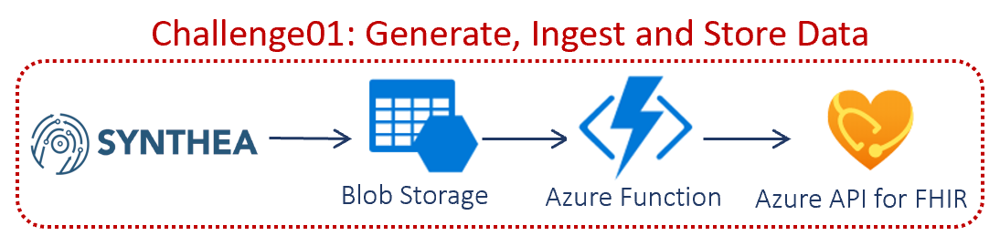
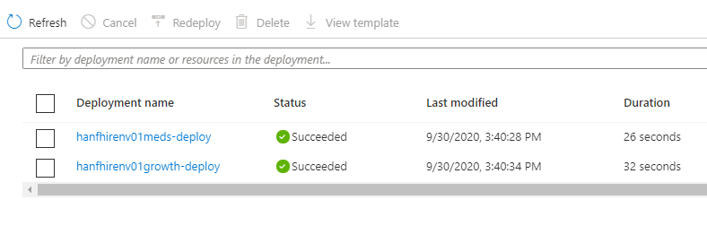
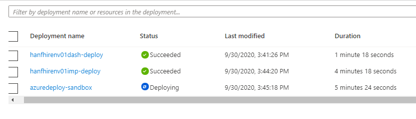
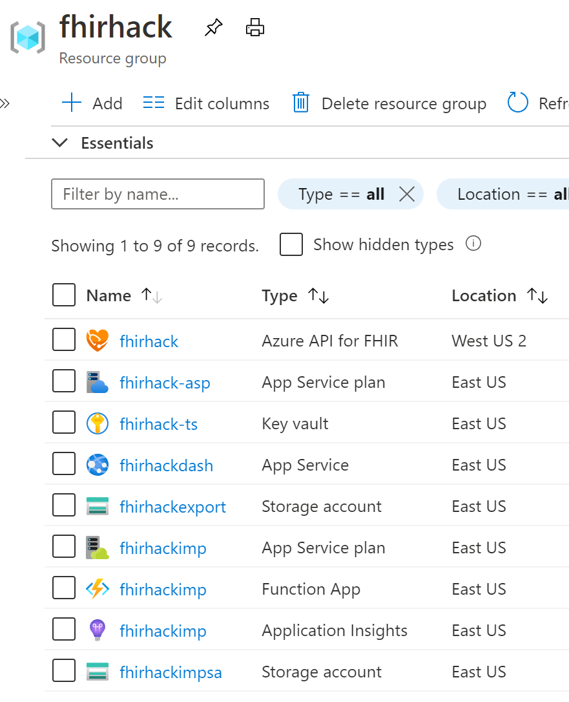
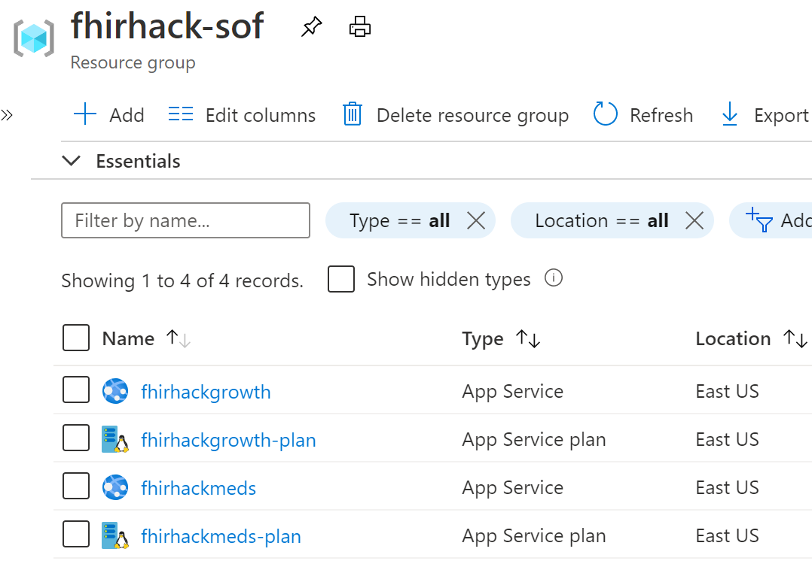
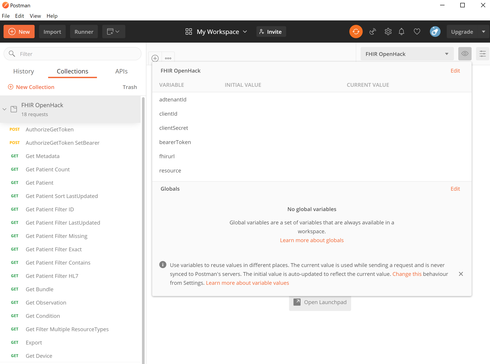
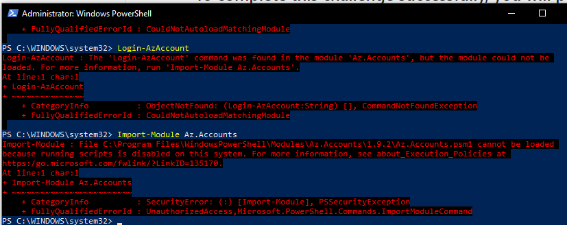

# Challenge01 - Azure API for FHIR

## Scenario
Your team has now learned a little about the FHIR standard. Our first challenge focuses on you as a software developer on the data interoperability team. **Any Healthcare’s** strategic direction is to build new solutions on public cloud resources wherever possible.

The first task has landed on you: In order to learn a bit about the capabilities of Azure’s API for FHIR, you will set up a development instance. This development instance is designed to highlight the key features, by building a demo-like environment. Once you are done with the setup you will verify the service is functioning by loading some synthetic data. The data is generated using Synthea which allows you to mimic EMR/EHR data. You will then use the dashboard app and run some basic queries to ensure the core functionality is working. 

## Reference Architecture
<center></center>

## To complete this challenge successfully, you will perform the following tasks.

* **Provision Azure API for FHIR demo environment**. Given the limited time, we'll provide a set of scripts to accomplish this. If you are interested in the details behind the script, check the appendix.
* **Load Synthetic data**. You can generate the data using Synthea or use a staged dataset we'll provide.
* **Validate data load**. You can use the dashboard application to validate the data or the provided APIs by using Postman.

## Before you start

**If you haven't completed [Challenge00](../Challenge00-Prerequistes/ReadMe.md), complete them now.**

* **Azure Subscription**: You will need permissions to perform CRUD operations in your Azure subscription.

* **Active Directory Tenants**
Active Directory is usually locked down at many customers as a securtiy best practice. Administrators control App Registrations and privilege to grant Role Assignments, users need extensive permissioning to get that unlocked. To avoid that road block, you can create another AD tenant. 
   * **NOTE** If you have full **Administrator access** to a AD tenant where you can create App Registrations, Role Assignments, Azure Resources... example: Visual Studio Subscription, then **Primary AD tenant is same as Secondary AD tenant**, use the same AD tenant for both.
   * If you **don't have Administrator access**:
      * **Primary (Resource) AD tenant**: This tenant is **Resource Control Plane** where all your **Azure Resources** will be deployed to.
      * **Secondary (Data) AD tenant**: This tenant is **Data Control Plane** where all your **App Registrations** will be deployed to.

* **Log into Primary (Resource) AD tenant**:
   * Open a new PowerShell session. Login using your Azure account where you want to deploy resources and authenticate. This will be referred to as **Primary (Resource) AD**, for clarity.
      ```powershell
      Login-AzAccount
      ```

      >   If you are seeing errors or you don't see the correct subscription in your **Primary (Resource) AD**, into which you want to deploy resources, you might be running in the wrong Azure context. Run the following to Clear, Set and then verify your Azure context.
      >   ```powershell
      >   Clear-AzContext
      >   Connect-AzAccount
      >   Set-AzContext -TenantId **{YourPrimary or Resource ADTenantID}** -SubscriptionId "Your Subscription ID"
      >   Get-AzContext
      >   ```

* **Create Secondary (Data) AD tenant**: Azure API for FHIR needs to be deployed into an Azure Active Directory tenant that allows for Data and Resource control plane authorization. Most companies lock down Active Directory App Registrations for security purposes which will prevent you from publishing an app, registering roles, or granting permissions. To avoid this, you will create a separate **Secondary (Data)** Active Directory domain. (A basic Azure Active Directory domain is a free service.)
   * Use a browser to navigate to the Azure Portal, navigate to Azure Active Directory. Click "Create a tenant". Enter an Organization name e.g. "{uniquename}fhirad". Enter an Initial domain name and click the Create button. This will be referred to as **Secondary (Data) AD** for clarity. 

   * Connect to your **Secondary (Data) AD** and authenticate. **DO NOT SKIP THIS**
      ```powershell
      Connect-AzureAd -TenantDomain **{{uniquename}fhirad}.onmicrosoft.com**
      ``` 
   * Replace **{{uniquename}fhirad}** with the name of the **Secondary (Data) AD** you created.

## Getting Started

## Task #1: Provision Azure API for FHIR demo environment.

   * If you get a security exception error, run the following PowerShell command to set the execution policy and, at the prompt, type 'a' to confirm it's ok to say yes to all changes to execution policy.
      ```powershell
      Set-ExecutionPolicy -Scope Process -ExecutionPolicy ByPass
      ```
   
* **Download the file** [fhir-server-samples](../Scripts/fhir-server-samples.zip) and unzip to local folder.
* This folder contains the script to provision all of the Azure API for FHIR resources. Navigate to the **fhir-server-samples\deploy\scripts** directory. Run the **one shot deployment.** Don't forget the **.\** before Create. Make sure to leave $true for EnableExport as it will needed in Challenge03.
   ```powershell
   cd fhir-server-samples/deploy/scripts
   
  .\Create-FhirServerSamplesEnvironment.ps1 -EnvironmentName <ENVIRONMENTNAME> -EnvironmentLocation eastus -UsePaaS $true -EnableExport $true
   ```
   * The **ENVIRONMENTNAME Example:fhirhack, THIS IS AN EXAMPLE, DO NOT USE THIS,** is a value used as the prefix for the Azure resources the script deploys, therefore it should be **globally unique**, all **lowercase** and **can't be longer than 12 characters**.
   * EnvironmentLocation could be specified, but for this hack, leave the default (eastus) as not all of the services we are provisioning are available in all regions.
   * We want the PaaS option, so leave that parameter set to $true.
   * When EnableExport is set to $true, bulkexport is turned on, service principle identity is turned on, storage account for export is created, access to storage account added to FHIR API through managed service identity, service principle identity is added to storage account.
   * **NOTE**: If you are using a **`*nix` platform (Mac or Linux)** you will see the error `Unable to find type [System.Web.Security.Membership]` because the `System.Web.Security.Membership` module is not part of PS Core on `*nix` platforms. You can overcome this by providing a password using this argument: `-adminPassword $(ConvertTo-SecureString -AsPlainText -Force '<Some Password Here>')`
   * If all goes well, the script will kickoff and will take about 10-15 minutes to complete. Note down the Key, Value and Name of **dashboardUserPassword** displayed when deployment is complete. You will need this in Task #3.
   * If the script throws an error, please check the **Help I'm Stuck!** section at the bottom of this page.
   * To check on the status of the deployment you can open the Azure Portal of the **Primary (Resource) AD** and you will see two resource groups will be created {ENVIRONMENTNAME} and {ENVIRONMENTNAME}-sof. You can look at the "deployments" to check the status of your resource creation. There should be five total deployments between the two resource groups. 
      <center></center> 
      <center></center>
      
---

Team Discussion Q: What is FHIR and how does FHIR improve on previous standards? (10 minutes)  

---

* On **successful completion**, you'll have two resource groups and lots of resources created with the prefix <ENVIRONMENTNAME>. Explore these resources and try to understand the role they play in your FHIR demo environment. NOTE: Application Insights is not available in all locations and will be provisioned in East US.

   The following resources in resource group **{ENVIRONMENTNAME}** Ex:fhirhack will be created:
   <center></center>

   * Azure API for FHIR ({ENVIRONMENTNAME}) is the FHIR server
   * Key Vault ({ENVIRONMENTNAME}-ts) stores all secrets for all clients (public for single page apps/javascripts that can't hold secrets, confidential for clients that hold secrets, service for service to service) needs to talk to FHIR server.
   * App Service/Dashboard App ({ENVIRONMENTNAME}dash) used to analyze data loaded.
   * App Service Plan ({ENVIRONMENTNAME}-asp) to support the App Service/Dashboard App.
   * Function App ({ENVIRONMENTNAME}imp) is the import function that listens on the import storage account where you can drop bundles that get loaded into FHIR server.
   * App Service Plan ({ENVIRONMENTNAME}imp) to support the Function App.
   * Application Insights ({ENVIRONMENTNAME}imp) to monitor the Function App.
   * Storage Account ({ENVIRONMENTNAME}export) to store the data when exported from FHIR server.
   * Storage Account ({ENVIRONMENTNAME}impsa) is the storage account where synthetic data will be uploaded for loading to FHIR server.


   The following resources in resource group **{ENVIRONMENTNAME}-sof** will be created for SMART ON FHIR applications:
   <center></center>

   * App Service/Dashboard App ({ENVIRONMENTNAME}growth) supports {ENVIRONMENTNAME}dash App.
   * App Service Plan ({ENVIRONMENTNAME}growth-plan) to support the growth App Service/Dashboard App.
   * App Service/Dashboard App ({ENVIRONMENTNAME}meds) supports {ENVIRONMENTNAME}dash App.
   * App Service Plan ({ENVIRONMENTNAME}meds-plan) to support the meds App Service/Dashboard App.

* Go to your **Secondary AD** in the Azure portal. Go to App Registrations. All three different client application types are registered here.

*  **Warning**: Azure Key Vault now **defaults to soft-delete**, a manual removal of the Azure Key Vault is required if you need to delete this deployment and start over.
   * Check if any Key Vaults are in soft-delete state: **Get-AzKeyVault -InRemovedState**
   * Remove Key Vault in soft-delete state: **Remove-AzKeyVault -VaultName {keyvaultname} -InRemovedState -Location {locationname}**

## Task #2: Generate & Load synthetic data.

* ### Option 1: Use Staged data
   * Download the generated [data](../Synthea/fhir.zip)
      * **NOTE:** there are 109 files in fhir.zip. You can choose to upload a small subset (10 files) to complete the upload faster and still have enough data to complete this OpenHack. 
      * Once the data has been downloaded, extract the .zip file. You can use the Azure Storage Explorer in the Azure portal or from your desktop app to upload the json files into the **fhirimport** blob container in the **{ENVIRONMENTNAME}impsa** storage account created for you in Task #1. 
      * As each file is loaded into the **fhirimport** container, the Azure function {ENVIRONMENTNAME}imp will be triggered to start the process of importing the data into your FHIR instance. For 50 users, assuming the default of 1,000 RUs for the Azure CosmosDB, it will take about 5-10 minutes to load the data. You can check the **fhirimport** folder in storage account **{ENVIRONMENTNAME}impsa** and when import is complete, all of your uploaded files will have been deleted. You can also go to **{ENVIRONMENTNAME}imp** Azure Function ** while the function is running**, click **Monitoring** and check **Log Stream** to view the status of the data import. If there are errors, the function retries and loads into Azure API for FHIR.

---

Team Discussion: What FHIR entities and attributes do you feel will be critical for your first FHIR API project? (10 minutes)

---

* ### Option 2: Generate Synthea data
   * **Setup Synthea**: 
      * This section shows how to generate health records with [Synthea](https://github.com/synthetichealth/synthea). 
      * Synthea requires [Java 8 JDK](https://www.oracle.com/java/technologies/javase/javase-jdk8-downloads.html). Make sure to select the JDK and not the JRE install.
      * After successfull installation of Java 8...
         * Option 2a: Manual Download: Download the [Synthea Jar File](https://github.com/synthetichealth/synthea/releases/download/master-branch-latest/synthea-with-dependencies.jar) 
         * Option 2b: Script Download: Open command prompt and run the below command. The .jar file will be downloaded to directory you are running the command from. If this command fails, you can follow the [Basic Setup and Running](https://github.com/synthetichealth/synthea/wiki/Basic-Setup-and-Running) guide.
            ```cmd
            curl -L https://github.com/synthetichealth/synthea/releases/download/master-branch-latest/synthea-with-dependencies.jar --output synthea-with-dependencies.jar
            ```
   * **Generate Data**:
      * Follow the instructions below to generate your synthetic data set. Note we are using the Covid19 module (-m "covid19") and generating a 50 person (-p 50) sample. 50 patients and related resources will be downloaded as json files to an output sub-folder.
         ```shell
         cd {directory_you_downloaded_synthea_to}
         java -jar synthea-with-dependencies.jar -m "covid19" -p 10
         ```
      * NOTE: using a value for `-p` that is large may result in a throttling exceptions in Cosmos. Uploading more than 10 files should be done in smaller batches to avoid this case. Higher throughput can be achieved by raising the Cosmos scaling thresholds, but the details of this are not covered in this challenge.
      * Once the data has been generated, you can use the Azure Storage Explorer in Portal or from your desktop App to upload the json files into the **fhirimport** folder in **{ENVIRONMENTNAME}impsa** storage account created in Task #1. 
      * Once the data is loaded into **fhirimport** folder, the Azure function {ENVIRONMENTNAME}imp will be triggered to start the process of importing the data into {ENVIRONMENTNAME} FHIR instance. For 50 users, assuming the default of 1000 RUs for the Azure CosmosDB, it will take about 5-10 minutes. You can check the **fhirimport** folder in storage account **{ENVIRONMENTNAME}impsa** and when import is complete there won't be any files. You can also go to **{ENVIRONMENTNAME}imp**, click Monitoring and check Log Stream. You will see the status of files getting loaded. If there are errors, the function retries and loads into Azure API for FHIR.

## Task #3: Validate Data Loaded

* ### Use the Dashboard App
    * Go to your **Secondary (Data) AD** tenant. Go to Azure AD, click on Users. Part of the deployment will create an admin user {ENVIRONMENTNAME}-admin@{uniquenamefhirad}.onmicrosoft.com. You can get the password from **dashboardUserPassword** you saved after Task #1. If you don't have it, click on the admin user and Reset password.
    * Go to **Primary (Resource) AD** tenant. Click on the App Service "{ENVIRONMENTNAME}dash". Copy the value of the App Service URL to your clipboard. Open the Azure portal in an "InPrivate" window. Navigate to the App Service URL from your clipboard and login using the admin user above. 
    * The dashboard will show you all the patients in the system where you can view each patient's medical details. You can click on the little black **fire** symbol against each record and view the FHIR bundle details.
      * You can click on resource links (e.g. Condition, Encounters, etc.) to examine those resources. 
    * Back on the Patients screen, click the little black **i** icon next to a patient record. You can check out the "Growth Chart" SMART ON FHIR Apps or explore the generated list of Encounters.
 
* ### Use Postman to run queries
    * Open Postman. (You should have installed it as part of Challenge 0, but you can get [Postman here](https://www.postman.com/downloads/) if you didn't already.)
    * We'll first import a pre-defined set of API calls. Go to the [Collection](../Postman/FHIR%20OpenHack.postman_collection.json) and click the **Raw** button. Copy all of this json to your clipboard. Back in the Postman app, click the **Import** button near the upper-left corner of the app. Click the **Raw Text** tab and paste the json content you copied here.  Click the **Continue** button and then the **Import** button. You should see a **FHIR OpenHack** collection in the left-hand pane in Postman.
    * Create an Environment. A Postman Environment is just a set of variables used across one or more of your API calls. Go to the [Environment](../Postman/FHIR%20OpenHack.postman_environment.json) and click the **Raw** button. Copy all of this json to your clipboard. Open Notepad, paste the json you just copied and save the file on your Desktop as **fhirenv.txt**. Back in Postman, in the upper-right, click the **Manage Environments** button (a gear icon). Click the **Import** button and click the **Choose Files** button. Browse to the **fhirenv.txt** file on your Desktop. Click the **FHIR OpenHack** environment to see it's list of variables. In the **Current and Initial Value** columns for each of the following variables, enter the corresponding values:
      * adtenantId: This is the **tenant Id of the Secondary (Data) AD** tenant
      * clientId: This is the **client Id** that is stored in **Secret** "{your resource prefix}-service-client-id" in "{your resource prefix}-ts" Key Vault.
      * clientSecret: This is the **client Secret** that is stored in **Secret** "{ENVIRONMENTNAME}-service-client-secret" in "{ENVIRONMENTNAME}-ts" Key Vault.
      * bearerToken: The value will be set when "AuthorizeGetToken SetBearer" request below is sent.
      * fhirurl: This is **https://{ENVIRONMENTNAME}.azurehealthcareapis.com** from Azure API for FHIR you created in Task #1 above.
      * resource: This is the Audience of the Azure API for FHIR **https://{ENVIRONMENTNAME}.azurehealthcareapis.com** you created in Task #1 above. You can find this Audience when you click Authetication in Azure API for FHIR you created in Task #1 above.
   * Click the **Update** button and close the **MANAGE ENVIRONMENTS** dialog.
   * In the Environments drop-down, select the **FHIR OpenHack** option.
   * You will see both the Collection on the left and the Environment on the top right.
      <center></center>
   * Run Requests:
      * Open "AuthorizeGetToken SetBearer". Confirm the environment you imported is selected in the drop-down in the top right. Click the Send button. This should pass the values in the Body to AD Tenant, get the bearer token back and assign it to variable **bearerToken**. The Body results also show how many seconds the token is valid before expires_in.
      * Open "Get Metadata" and click the **Send** button. This will return the CapabilityStatement with a Status of 200 ....This request doesn't use the bearerToken.
      * Open "Get Patient" and click the **Send** button. This will return all Patients stored in your FHIR server. (Postman may not show all of the results.)
      * "Get Patient Count" will return Count of Patients stored in your FHIR server.
      * "Get Patient Sort LastUpdated" will returns Patients sorted by LastUpdated date. This is the default sort.
      * "Get Patient Filter ID" will return one Patient with that ID. Change the ID to one you have loaded and analyze the results.
      * "Get Patient Filter Missing" will return data where gender is missing. Select a different column and analyze the results.
      * "Get Patient Filter Exact" will return a specific Patient with a given name. Select a different name and analyze the results.
      * "Get Patient Filter Contains" will return Patients with letters in the given name. Select different letters and analyze the results.
      * "Get Filter Multiple ResourceTypes" will return multiple resource types in _type. Select another resource type and analyze the results.
      * NOTE: bearerToken expires soon, so if you get Authentication errors in any requests, re-run "AuthorizeGetToken SetBearer" to get a new bearerToken.

## Task #4: Clean Up Resources
* **Pause/Disable/Stop** Azure resources created above if you are NOT going to use them immediately.
* **Delete** Azure resources created above if you DON'T need them anymore.

---

Break (15 minutes)

---

## Congratulations! You have successfully completed Challenge01! 

## Help, I'm Stuck!
Below are some common setup issues you might run into with possible resolution. If your error/issue is not here and you need assistance, please let your coach know.

* **{ENVIRONMENTNAME} variable error**: EnvironmentName is used as a prefix for naming Azure resources and you must still adhere to Azure naming guidelines. The value has to be **globally unique** and **can't be longer than 12 characters**. Here's an example of an error you might see due to a long name:
   <center></center>

* **PowerShell Execution Policy errors**: In order to allow unsigned scripts and scripts from remote repositories, you might see one of the below errors:
   <center></center>
   <center></center>

   To allow PowerShell to run these scripts and resolve the errors, run the following command:
   ```powershell
   Set-ExecutionPolicy -Scope Process -ExecutionPolicy ByPass
   ```
* **Git Missing**: This challenge uses scripts from Git. If you don't have Git installed, you might see something similiar to the error below. Get [Git](https://git-scm.com/downloads) and try again.
   <center></center>

* **Windows Terminal running PowerShell**: This is a known issue.
Connect-AzureAD -TenantID <tenantid> does not open the Auth Login popup. This happens in both admin mode and non-admin mode.

* **Unable to find type [System.Web.Security.Membership]**: This can occurr when running `Create-FhirServerSamplesEnvironment.ps1` because the `System.Web.Security.Membership` module is not part of PS Core on `*nix` platforms. You can overcome this by providing a password using this argument:
  ```powershell
  -adminPassword $(ConvertTo-SecureString -AsPlainText -Force '<Some Password Here>')
  ```

* **Assembly with same name is already loaded**: If you are following the hints for `*nix` users, you may see this in the case that the `AzureAD` was installed before attempting to install `AzureAD.Standard.Preview`. You can overcome this by uninstalling the `AzureAD` module before installing the `AzureAD.Standard.Preview` module:
  ```powershell
  Uninstall-Module AzureAD
  ```
***

[Go to Challenge02 - HL7 Ingest and Convert: Ingest HL7v2 messages and convert to FHIR format](../Challenge02-HL7IngestandConvert/ReadMe.md)
