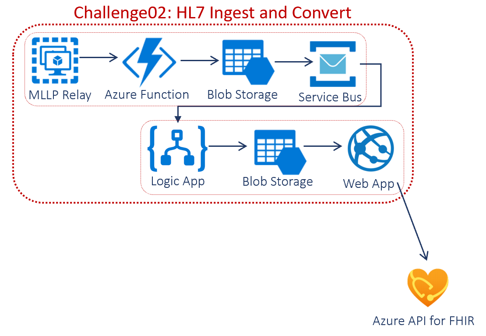
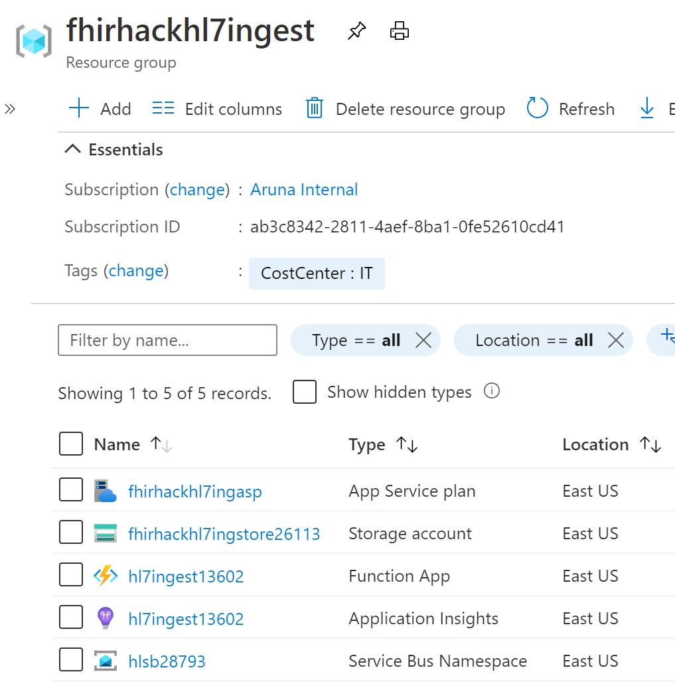
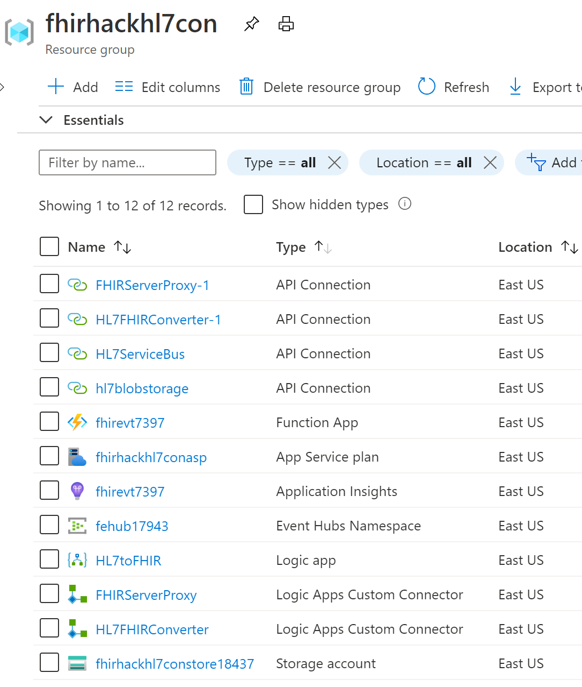
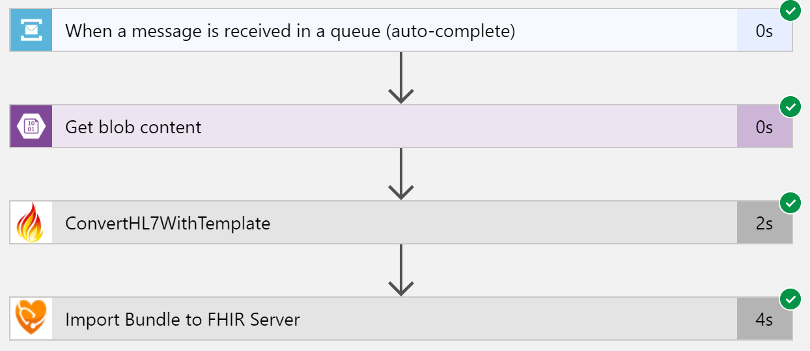
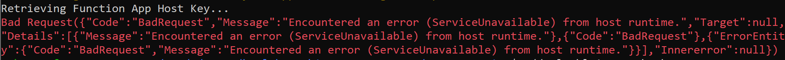

# Challenge02 - HL7 Ingest and Convert

## Scenario
With Azure API for FHIR up and running with basic EHR synthetic data, you will focus on this challenge of ingesting legacy data from a different format into Azure API for FHIR. Most (but of course not all) of your existing healthcare applications use some version of HL7, and you have to ingest those HL7 messages and convert them into FHIR format. By establishing FHIR as a hub of sorts, you’ll be able to aggregate data from these various systems and enable interoperability.

First, you need to ingest HL7 legacy data using secure transfer, place into an Azure Blob storage and create comsumable events on service bus for processing. You’ll validate if this is working by checking for the files loaded into the Azure Blob Storage using Storage Explorer.
Then you will use Logic Apps connector and FHIR Converter to convert those messages into valid FHIR format to load into Azure API for FHIR. You’ll validate if this is working by learning some new query capabilities.

## Reference Architecture
<center></center>

## To complete this challenge successfully, you will perform the following tasks.

* **Ingest HL7v2 sample message** using HL7overHTTPS secure transfer into Azure Blob Storage.
* **Convert HL7v2 message into FHIR format**. You will create a workflow that performs orderly conversion.
* **Validate data load**. You will validate the data using Postman.

## Before you start

* Make sure you have completed the pre-work covered in the previous challenge: [Challenge00 - Pre-requisites: Technical and knowledge requirements for completing the Challenges](../Challenge00-Prerequistes/ReadMe.md).

* Make sure you have completed Challenge01: [Challenge01 - Azure API for FHIR: Generate, Ingest and Store synthetic data into Azure API for FHIR](../Challenge01-AzureAPIforFHIR/ReadMe.md).

## Getting Started

The [FHIR Converter](https://github.com/microsoft/FHIR-Converter) is an open source project that enables healthcare organizations to convert legacy data (currently HL7 v2 messages) into FHIR bundles. Converting legacy data to FHIR expands the use cases for health data and enables interoperability.

## Task #1: HL7 Ingest
The HL7 ingest platform consumes HL7 Messages via MLLP and securely transfers them to Azure via HL7overHTTPS. The data lands in blob storage and produces a consumable event on a high-speed service bus for processing.

In this task, you will:
1. Consume MLLP HL7 Messages
2. Securely transfer them to Azure via [HL7overHTTPS](https://hapifhir.github.io/hapi-hl7v2/hapi-hl7overhttp/specification.html)
3. Place in blob storage for audit/errors
4. Produce a consumable event on a high-speed service bus for processing

Let's get started:
* Download this [repo](https://github.com/microsoft/health-architectures).
* [If you are running Windows 10, enable Windows Linux Subsystem](https://code.visualstudio.com/docs/remote/wsl-tutorial#_enable-wsl) 
* [Install a Linux Distribution](https://code.visualstudio.com/docs/remote/wsl-tutorial#_install-a-linux-distro). Download Ubuntu from Microsoft Store.
* [Install Azure CLI 2.0 on Linux based System or Windows Linux Subsystem](https://docs.microsoft.com/en-us/cli/azure/install-azure-cli-apt?view=azure-cli-latest#install-with-one-command) 
* Open a bash shell into the Azure CLI 2.0 environment.
* Login using **az login**
* Switch to the HL7Conversion subdirectory of this repo using **cd /mnt/{Your HL7Conversion directory path}** (likely /mnt/health-architectures/HL7Conversion). Use cd one directory at a time if the whole path is not working.
* Run the **./deployhl7ingest.bash** script and follow the prompts to enter Subscription ID, Resource Group Name, Resource Group Location, Deployment Prefix, etc. This will take approximately five minutes to complete.

* The resources deployed will be displayed between two double-star lines. **Copy** this and keep it handy for Task #2.

* Find the resource groups you created in your subscription and you should see the following resources:
  <center></center>

* To test, send an HL7 message via HL7 over HTTPS:
   * Locate the sample message **samplemsg.hl7** in the "HL7Conversion" directory of the "health-archtiectures" repo.
   * Use a text editor to see contents.
   * From the linux command shell, run the following command to test the hl7overhttps ingest. 
     ```
       curl --trace-ascii - -H "Content-Type:text/plain" --data-binary @samplemsg.hl7 <your ingest host url from above>/api/hl7ingest?code="<your ingest host key from above>"
     ``` 
   * You should receive back an HL7 ACK message. (ACK is an 'Acknowledgement' message verifying the call was successful.)
     <center></center>

   * Validate the sample HL7 message made its way to the HL7 folder in the storage account created.
   * Congratulations!!! The sample HL7 message was accepted securely stored into blob storage and queued for further ingest processing on the deployed service bus queue
* [Optional] Send in HL7 messages using the local HL7 MLLP Relay. To run a local copy of the HL7 MLLP Relay:
   * Make sure [Docker](https://www.docker.com/) is installed and running in your linux or windows environment
   * From a command prompt run the runhl7relay.bash(linux) or runhl7relay.cmd(windows) passing in the HL7ingest Function App URL (saved from above) and the function app access key (also saved from above) as parameters.
        ```
        runhl7relay https://<your ingest host name from above/api/hl7ingest "<function app key from above>"
       ``` 
   * You can now point any HL7 MLLP Engine to the HL7 Relay listening port (default is 8079) and it will transfer messages to the hl7ingest function app over https.
   * An appropriate HL7 ACK will be sent to the engine from the relay listener.

## Task #2: HL7 Conversion to FHIR
In this task, you will:
* Create a logic app based workflow to perform orderly conversion from HL7 to FHIR via the [FHIR Converter](https://github.com/microsoft/FHIR-Converter), persists the message into an [Azure API for FHIR Server Instance](https://azure.microsoft.com/en-us/services/azure-api-for-fhir/), and publishes FHIR change events referencing FHIR resources to a high-speed event hub to interested subscribers.
Features of the HL7toFHIR Conversion Platform:

Let's get started:
* [Deploy the HL7 Ingest Platform](#ingest) if you have not already.
* You will need the following information to configure the HL72FHIR services:
   + The **Client ID for the Service Client**. You can get this from the corresponding Secret in your Key Vault deployed in [Challenge01](../Challenge01-AzureAPIforFHIR/ReadMe.md).
   + The **Client Secret for the Service Client**. You can get this from the corresponding Secret in your Key Vault deployed in [Challenge01](../Challenge01-AzureAPIforFHIR/ReadMe.md).
   + The **Secondary AD Tenant ID for the Service Client**. You can get this from [Challenge01](../Challenge01-AzureAPIforFHIR/ReadMe.md).
   + The **Audience for the Azure API for FHIR Server** typically https://{name}azurehealthcareapis.com
* You will need the following information from the HL7 Ingest platform deployment (**provided at the end of your Task #1 deployment**):
   + The resource group name created
   + The storage account name created
   + The service bus namespace created
   + The service bus destination queue name created
* Open a shell or command window into the Azure CLI 2.0 environment
* Switch to HL7Conversion subdirectory of this repo
* Run the **./deployhl72fhir.bash** script and follow the prompts. This will take ~10 minutes to complete.

* You should receive back an HL7 ACK message  
   <center></center>
* After successful deployment, your converter pipeline is now tied to your ingest platform from above. 
* The following resources in resource group names you provided above will be created:
   <center></center>

   <center></center>

* To test, send in an HL7 message via HL7 over HTTPS:
    + Locate the sample message **samplemsg.hl7** in the root directory of the repo.
    + Use a text editor to see contents.
    + From the linux command shell, run the following command to test the hl7overhttps ingest.
      ```
        curl --trace-ascii - -H "Content-Type:text/plain" --data-binary @samplemsg.hl7 <your ingest host url from above>/api/hl7ingest?code=<your ingest host key from above>
      ``` 
* You can also see execution from the HL7toFHIR Logic App Run History in the HL7toFHIR resource group.  
   <center></center>

## Task #3: Validate Data Loaded using Postman
* If you haven't set up Postman in [Challenge01](../Challenge01-AzureAPIforFHIR/ReadMe.md), go back and complete that. 
* Open **AuthorizeGetToken SetBearer**, choose "FHIR Hack" in environments drop-down and click the **Send** button. This will set the Bearer Token to the variable.
* Open **Get Patient Filter HL7** request in FHIR Hack folder and click the **Send** button. This should return the patient with the family name EVERYMAN from sample HL7 file loaded.

## Task #4: Clean Up Resources
* **Pause/Disable/Stop** Azure resources created above if you are NOT going to use it immediately.
* **Delete** Azure resources created above if you DON'T need them anymore.

## Congratulations! You have successfully completed Challenge02!

## Help, I'm Stuck!
Below are some common setup issues you might run into with possible resolutions. If your error/issue are not listed here, please let your coach know.
* If the Logic App is failing at step "ConvertHL7WithTemplate" with an app timeout error, continue reading. When deploying HL7Conversion flow using deployhl72fhir.bash, the App Service will deploy a P1v2 SKU. If your subscription doesn't support the Premium option, you will get an error. Change it to the Standard S1 SKU and it will still work.
* When deploying ./deployhl7ingest.bash, if you get the below error, delete the resource group partically created and re-run.
   <center></center>
* When deploying ./deployhl7ingest.bash, if you get the below error, re-clone the Git.
   <center></center>
* The resources are inserted into the FHIR server every time the Logic App runs. To change to update, double-click on Patient in the template, scroll all the way to the bottom of the template, change the method from POST to PUT. To have the resource be used the reference ID, change the url to resource?_id={{ID}} where resource is Patient in this case. Repeat the same for all resources.
* If the .hl7 file you are trying to convert doesn't have out of the box template, check this [Git](https://github.com/microsoft/FHIR-Converter) on how to create new templates.


***

[Go to Challenge03 - Export and Anonymize: Bulk export data from Azure API for FHIR and deidentify the data](../Challenge03-ExportandAnonymizeData/ReadMe.md)
