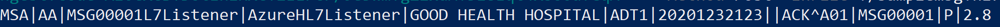
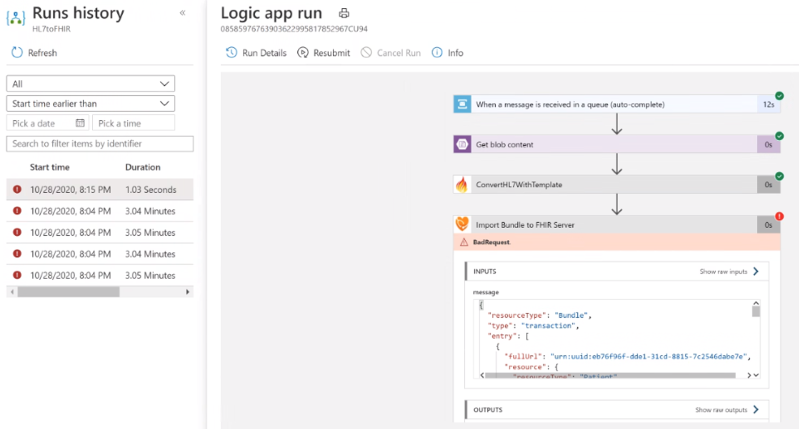
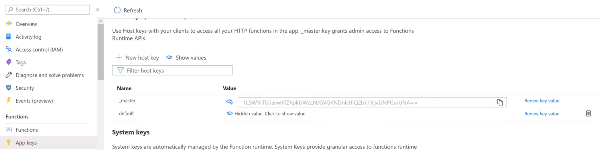
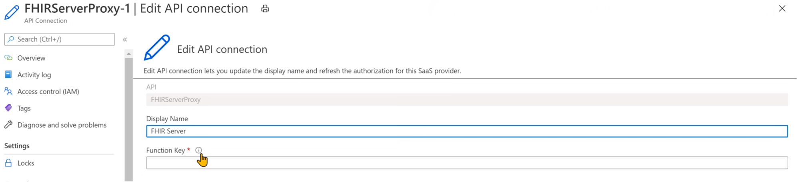

# Challenge02.2 - HL7 Ingest and Convert - Using PowerShell Scripts

## Scenario
With Azure API for FHIR up and running with basic EHR synthetic data, you will focus on this challenge of ingesting legacy data from a different format into Azure API for FHIR. Most (but of course not all) of your existing healthcare applications use some version of HL7, and you have to ingest those HL7 messages and convert them into FHIR format. By establishing FHIR as a hub of sorts, you’ll be able to aggregate data from these various systems and enable interoperability.

First, you need to ingest HL7 legacy data using secure transfer, place into an Azure Blob storage and create comsumable events on service bus for processing. You’ll validate if this is working by checking for the files loaded into the Azure Blob Storage using Storage Explorer.
Then you will use Logic Apps connector and FHIR Converter to convert those messages into valid FHIR format to load into Azure API for FHIR. You’ll validate if this is working by learning some new query capabilities.

## Reference Architecture
<center></center>

## To complete this challenge successfully, you will perform the following tasks.

* **Ingest HL7v2 sample message** using HL7overHTTPS secure transfer into Azure Blob Storage.
* **Convert HL7v2 message into FHIR format**. You will create a workflow that performs orderly conversion.
* **Validate data load**. You will validate the data using Postman.

## Before you start

* Make sure you have completed the pre-work covered in the previous challenge: [Challenge00 - Pre-requisites: Technical and knowledge requirements for completing the Challenges](../Challenge00-Prerequistes/ReadMe.md).

* Make sure you have completed Challenge01: [Challenge01 - Azure API for FHIR: Generate, Ingest and Store synthetic data into Azure API for FHIR](../Challenge01-AzureAPIforFHIR/ReadMe.md).

## Getting Started

The [FHIR Converter](https://github.com/microsoft/FHIR-Converter) is an open source project that enables healthcare organizations to convert legacy data (currently HL7 v2 messages) into FHIR bundles. Converting legacy data to FHIR expands the use cases for health data and enables interoperability.

## Task #1: HL7 Ingest and Conversion to FHIR
The HL7 ingest platform consumes HL7 Messages via MLLP and securely transfers them to Azure via HL7overHTTPS. The data lands in blob storage and produces a consumable event on a high-speed service bus for processing.
The HL7 convert is a logic app based workflow that performs orderly conversion from HL7 to FHIR via the [FHIR Converter](https://github.com/microsoft/FHIR-Converter), persists the message into an [Azure API for FHIR Server Instance](https://azure.microsoft.com/en-us/services/azure-api-for-fhir/), and publishes FHIR change events referencing FHIR resources to a high-speed event hub to interested subscribers.

**Let's get started:**
* **Download the file** [health-architectures-master](../Scripts/health-architectures-master.zip) and unzip to local folder.
* Open a new PowerShell session. Login using your Azure account where you want to deploy resources and authenticate. This will be referred to as **Primary (Resource) AD**.
   ```powershell
   Login-AzAccount
   ```
* Connect to your **Secondary (Data) AD** and authenticate. This was created in Challenge01. Replace **{{uniquename}fhirad}** with the name of the **Secondary (Data) AD** you created.
      ```powershell
      Connect-AzureAd -TenantDomain **{{uniquename}fhirad}.onmicrosoft.com**
      ``` 
   
* Switch to the HL7Conversion subdirectory in [health-architectures-master](../Scripts/health-architectures-master.zip) you downloaded above.
* Run the deployment script and follow the prompts.
   ```powershell
   ./fhirhl7deployment.ps1
   ```

  **This will take ~15-20 minutes to complete.**

---

Team Discussion: What are the common HL7 message formats? How are they generated at healthcare organizations? How much data do you think is ingested everyday? (10 minutes)

---

* The Ingest and Convert resources deployed will be displayed between two double-star lines. **Copy** this and keep it handy as you need it for below.

* Find the resource group names you provided during the deployment in your subscription and you should see the following resources:
   <center></center>

   <center></center>

   <center></center>


* To test, send an HL7 message via HL7 over HTTPS:
   * Locate the sample message **samplemsg.hl7** in the "HL7Conversion" directory.
   * Use a text editor to view contents, if needed.
   * From PowerShell, replace **ingest host name** and **ingest host key** below and run the following command. 
      ```powershell
      Invoke-RestMethod -Headers @{"Accept" = "text/plain"} -uri "https://<ingest host name>.azurewebsites.net/api/hl7ingest?code=<ingest host key>" -Method Post -InFile ./samplemsg.hl7
      ``` 
   * You should receive a message like the below that indicates upload was successful.
     <center></center>

   * Navigate to the Ingest Resource Group created above, click on the Storage Account, click on Container, click on HL7 Container and check if the sample HL7 message is there. The file name will start with ADT_A01, which is the type of this sample message.
   * Navigate to Convert Resource Group created above, click on "HL7toFHIR" Logic App. View Run History.  
      <center></center>

   * Congratulations!!! The sample HL7 message was ingested, converted and stored in Azure API for FHIR.

---

Team Discussion: How are the healthcare organizations converting HL7 messages into consumable common data model? How does that compare with this? (10 minutes)

---

## Task #2: Validate Data Loaded using Postman
* If you haven't set up Postman in [Challenge01](../Challenge01-AzureAPIforFHIR/ReadMe.md), go back and complete that. 
* Open **AuthorizeGetToken SetBearer**, choose "FHIR Hack" in environments drop-down and click the **Send** button. This will set the Bearer Token to the variable.
* Open **Get Patient Filter HL7** request in FHIR Hack folder and click the **Send** button. This should return the patient with the family name EVERYMAN from sample HL7 file loaded.

## Task #3: Clean Up Resources
* **Pause/Disable/Stop** Azure resources created above if you are NOT going to use it immediately.
* **Delete** Azure resources created above if you DON'T need them anymore.

## Congratulations! You have successfully completed Challenge02!

---

Break (15 minutes)

---

## Help, I'm Stuck!
Below are some common setup issues you might run into with possible resolutions. If your error/issue are not listed here, please let your coach know.
* If the Logic App in Task #1 is failing at step "ConvertHL7WithTemplate" with an app timeout error, continue reading. When deploying, the App Service will deploy a P1v2 SKU. If your subscription doesn't support the Premium option, you will get an error. Change it to the Standard S1 SKU and it will still work.
* The resources are inserted into the FHIR server every time the Logic App runs. To change to update, double-click on Patient in the template, scroll all the way to the bottom of the template, change the method from POST to PUT. To have the resource be used the reference ID, change the url to resource?_id={{ID}} where resource is Patient in this case. Repeat the same for all resources.
* If the .hl7 file you are trying to convert doesn't have out of the box template, check this [Git](https://github.com/microsoft/FHIR-Converter) on how to create new templates.
* If the Logic App **HL72FHIR** in Task #1 is failing at the last step 
   * With this error:
   <center></center>

   * Go to the Function App deployed in Task #2, click on App Keys and copy the Value of _master:
   <center></center>

   * Go to the API Connection **FHIRServerProxy-1** deployed in Task #2, Edit the API Connection, and paste the key:
   <center></center>


***

[Go to Challenge03 - Export and Anonymize: Bulk export data from Azure API for FHIR and deidentify the data](../Challenge03-ExportandAnonymizeData/ReadMe.md)
