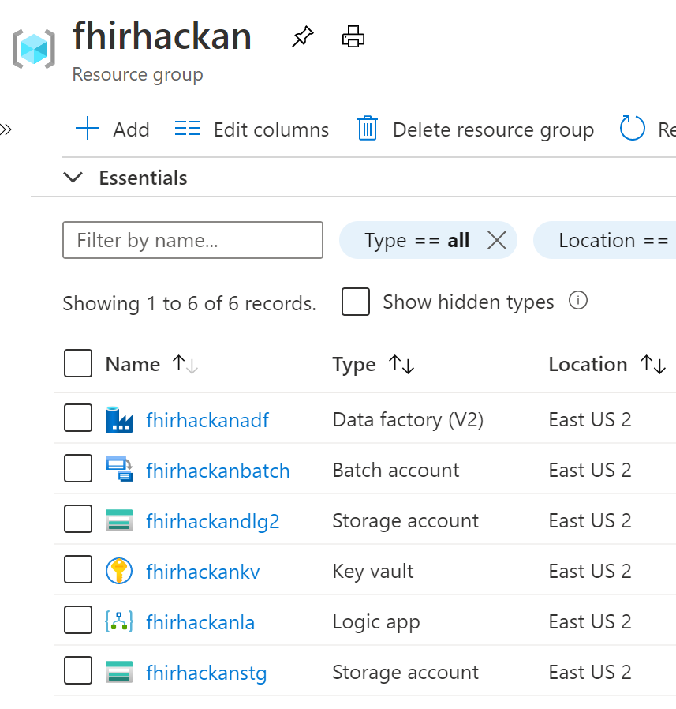
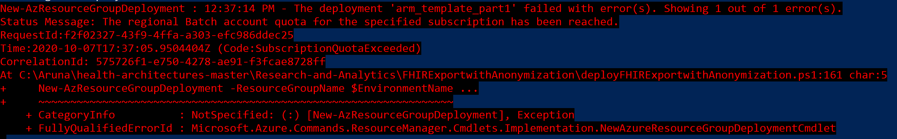
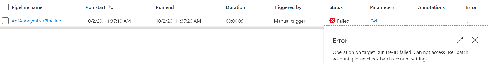

# Challenge03 - Export and Anonymize FHIR data

## Scenario
You’ve got the core functionality of your new FHIR-based “hub” all set up! Congratulations!!

Moving data between systems is great, but you’ve yet to provide real BUSINESS value. That changes now as a business unit has come to you with a need to utilize your aggregated data to analyze several COVID-related data points in the hopes of identifying potential outbreaks early.

At this point, the team has an existing system set up for their data experiments so they just need a snapshot export of your FHIR-based data. As a health care provider we need to take special care to annonomize all data, afterall we don't want to accidentally create a HIPPA violation. The business unit feels confident they can accomplish quite a bit with anonymized data (and that makes the privacy team happy).

First, you will need to bulk export the data from Azure API for FHIR into Azure Blob Storage. You’ll validate that this is working by checking for the files loaded into the Azure Blob Storage using the Azure Portal. Then you'll download and use the FHIR Data tools to manually anonomize them.  Finally, you'll automate this process by setting up an Azure Data Factory pipeline to deidentify and store that data into Azure Data Lake. You’ll validate that this is working through the Azure portal.

## Reference Architecture
<center></center>

* **Azure Logic App**:
   * is triggered by a timer, 1:00 AM UTC is the default
   * calls **FHIR service** with GET $export call to export data into **Blob Storage**
   * runs an Until loop on a five minute interval checking for the Bulk Export $export to finish. The frequency is adjustable inside the **Logic App**.
   * sends the $export storage location information to **Azure Data Factory**
* **FHIR server**:
   * pushes bulk export to preset storage location. This Storage Account ({ENVIRONMENTNAME}export) was created in [Challenge01](../Challenge01-AzureAPIforFHIR/ReadMe.md).
* **Azure Data Factory**:
   * calls **Azure Batch** with the storage location information
   * **Azure Batch** performs the deidentification with the FHIR Tools for Anonymization
   * put the deidentified data in **Azure Data Lake Gen2**

## To complete this challenge successfully, you will perform the following tasks.

* **Bulk Export FHIR data**: Logic app bulk exports FHIR data into Blob Storage
* **Anonymize FHIR data**: Logic app runs Data Factory pipeline which calls Azure Batch for deidentifying the data and stores in Azure Data Lake
* **Validate data load**. You will validate the data using the Azure Portal.

## Before you start

* Make sure you have completed the pre-work covered in the previous challenge: [Challenge00 - Pre-requisites: Technical and knowledge requirements for completing the Challenges](../Challenge00-Prerequistes/ReadMe.md).

* Make sure you have completed [Challenge01 - Azure API for FHIR: Generate, Ingest and Store synthetic data into Azure API for FHIR](../Challenge01-AzureAPIforFHIR/ReadMe.md).

## Getting Started

## Task #1: Setup
* Enable Export
   If you deployed Azure API for FHIR in [Challenge01](../Challenge01-AzureAPIforFHIR/ReadMe.md) with EnableExport $false, then follow the instructions here for attaching the FHIR service to the storage account. <https://docs.microsoft.com/en-us/azure/healthcare-apis/configure-export-data>

* **Download the file** [health-architectures-master](../Scripts/health-architectures-master.zip) and unzip to local folder.

* Update **Parameters** file
   * Navigate to health-architectures-master/Research-and-Analytics\FHIRExportwithAnonymization folder. 
   * Open the ./Assets/arm_template_parameters.json file in your perferred json editor. 
   * Add the value for fhirserver-url. This is the Azure API for FHIR Server URL, typically https://{name}azurehealthcareapis.com.
   * Add the value for fhirserver-clientid. This is Service Client ID. You can get this from the Secret in Key Vault deployed in [Challenge01](../Challenge01-AzureAPIforFHIR/ReadMe.md).
   * Add the value for fhirserver-clientSecret. This is Service Client Secret. You can get this from the Secret in Key Vault deployed in [Challenge01](../Challenge01-AzureAPIforFHIR/ReadMe.md).
   * Add the value for fhirauth-tenantid. This is your SecondaryAD Tenant ID. You can get this from [Challenge01](../Challenge01-AzureAPIforFHIR/ReadMe.md).
   * Add the value for IntegrationStorageAccount. This is created in [Challenge01](../Challenge01-AzureAPIforFHIR/ReadMe.md) typically {ENVIRONMENTNAME}export.
   * Save & close the parameters file.

* Optional Setup:
The FHIR Export with Anonymization uses the default settings in the Anonymization toolset. If you would like other settings, please follow theses steps prior to deployment:
   * Find and copy the zip file ./Assets/AdfApplication.zip to a new temporary location.
   * Unzip the file.
   * In the unzipped folder, locate the file called configuration-sample.json.
   * Open the file and make your setting adjustments. Configuration file settings can be found [here]( https://github.com/microsoft/FHIR-Tools-for-Anonymization#configuration-file-format).
   * Save your configuration changes.
   * Zip the folder backup. Make sure the zipped folder is the same name 'AdfApplication.zip'.
   * Replace the zip file in the Assets folder with the new zip file.

## Task #2: Deploy to Bulk Export and Anonymize FHIR data

* Open **PowerShell** and navigate to this directiory:
   ```powershell
   cd health-architectures-master\Research-and-Analytics\FHIRExportwithAnonymization
    ```

* **Connect to Secondary AD** and authenticate. **DO NOT SKIP THIS**.
    ```powershell
    Connect-AzureAd -TenantDomain **Secondary AD Tenant**
    ```

* **Deploy** the pipeline and enter a **new {ENVIRONMENTNAME}** when prompted. This will create a new Resource Group with that name, and deploy all services in that Resource Group. EnvironmentLocation is eastus by default.
   ```powershell
   ./deployFHIRExportwithAnonymization.ps1 
   ```

   This deployment process may take five minutes or more to complete.

*  **Warning**: Azure Key Vault now **defaults to soft-delete**, a manual removal of the Azure Key Vault is required if you need to delete this deployment and start over.
   * Check if any Key Vaults are in soft-delete state: **Get-AzKeyVault -InRemovedState**
   * Remove Key Vault in soft-delete state: **Remove-AzKeyVault -VaultName {keyvaultname} -InRemovedState -Location {locationname}**

* The following resources in resource group {ENVIRONMENTNAME} will be created:
   <center></center>

   * Azure Data Factory {ENVIRONMENTNAME}adf
   * Batch Account {ENVIRONMENTNAME}batch
   * Key Vault {ENVIRONMENTNAME}kv
   * Logic App {ENVIRONMENTNAME}la
   * Storage Account {ENVIRONMENTNAME}dlg2

* Update **{ENVIRONMENTNAME}kv KeyVault** for Export Storage Account
   * Open the Azure Portal. Navigate to **Resource Group** deployed in [Challenge01](../Challenge01-AzureAPIforFHIR/ReadMe.md). 
   * Locate the **{ENVIRONMENTNAME}export** Storage account. Click **Access key** under **Settings**. Copy one of the **connection string**s. 
   * Navigate to the **{ENVIRONMENTNAME}kv** deployed above in this challenge. Click to open. 
   * Click **Secrets** under **Settings**. Click the secret **blobstorageacctstring**. Click **+ New Version**. In the **Value** box, paste the **connection string** you just copied. Click **Create** button at the bottom the page.

   Time to export data and do some research!

## Task #3: Validate Data Loaded
* Go to Resource Group **{ENVIRONMENTNAME}** created in this Challenge.
* Click on the **Logic App** and click **Run Trigger**. You can click on the Running status in Runs History below in the same screen. The time taken to complete depends on the volume of data you have in Azure API for FHIR.

---

Team Discussion: Is data anonymization an option? What scenarios would it not be? (10 minutes)

---

* When completed successfully, compare the pre and post de-identified data. 
   * **Pre de-identified data** is in the Storage Account **{ENVIRONMENTNAME}export** in **Resource Group** deployed in [Challenge01](../Challenge01-AzureAPIforFHIR/ReadMe.md). Look for the container with the latest date. The pre de-identified json files exported from Azure API for FHIR are stored here.
   * **Post de-identified data** is in the Storage Account **{ENVIRONMENTNAME}dlg2** created in this Challenge. Look for the container with output as suffix. The post de-identified json files are stored here.

## Task #4: Clean Up Resources
* **Pause/Disable/Stop** Azure resources created above if you are NOT going to use it immediately.
* **Delete** Azure resources created above if you DON'T need them anymore.

## Congratulations! You have successfully completed Challenge03!

---

Break (15 minutes)

---

## Help, I'm Stuck!
Below are some common setup issues that you might run into with possible resolutions. If your error/issue is not here, please let your coach know.

* If you get Azure Batch error, either Azure Batch is not enabled in your subscription or Azure Batch already deployed the max number of time in your subscription.
   <center></center>

* If you would like to adjust the start time or run interval, open the Logic App in the deployed resource group. The first step called 'Recurrence' is where the timer is stored.

* Logic App failed on **Get Token**
   * Go to Portal, go to **Secondary AD tenant**, search App Registrations, click on {ENVIRONMENTNAME}-service-client. {ENVIRONMENTNAME} is the one you used in Challenge01. Click Certificates & Secrets on the left. Click + New client secret, type a name, click Add. **Copy** the new Secret.
   * Go to the **Primary AD tenant**, go to the KeyVault created by the ARM template in Challenge 3. Click Secrets on the left. Click on {ENVIRONMENTNAME}-clientsecret. Click + New Version. **Paste** the Secret you copied above. Click Create.
   * Re-run the Logic App.

* Logic App succeeded, but no output was found in Storage Account **{ENVIRONMENTNAME}dlg2**.  
   * Check if the Azure Data Factory succeeded. Click on Data Factory resource in the Resource Group deployed above. Click Author and Monitor in the center of the screen, click on Monitor botton on the left, you will see Pipelines Runs. If you see the below error, check if you updated **blobstorageacctstring** secret in **{ENVIRONMENTNAME}kv KeyVault** with **connection string** of  Export Storage Account.
   <center></center>
***

[Go to Challenge04 - IoT Connector for FHIR: Ingest and Persist device data from IoT Central](../Challenge04-IoTFHIRConnector/ReadMe.md)

## References
* [HIPPA Safe Harbor Method](https://www.hhs.gov/hipaa/for-professionals/privacy/special-topics/de-identification/index.html)
* [HL7 bulk export](https://hl7.org/Fhir/uv/bulkdata/export/index.html)
* [FHIR Tools for Anonymization](https://github.com/microsoft/FHIR-Tools-for-Anonymization)
