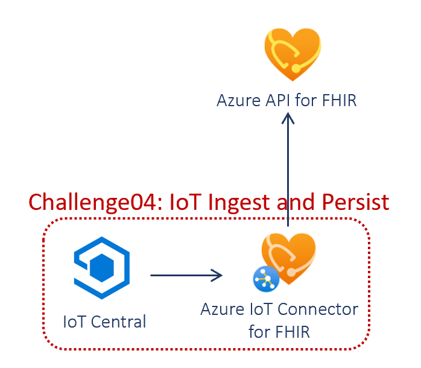
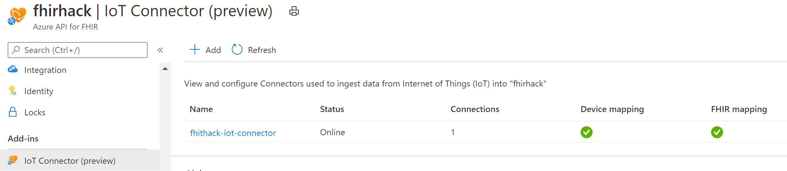
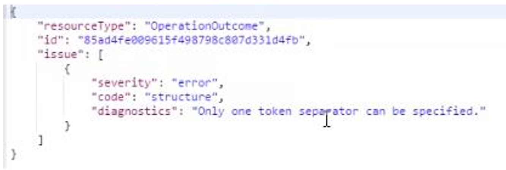

# Challenge04 - IoT Converter for FHIR

## Scenario
The business unit you worked with is ecstatic with the data you provided and they’ve made tons of great progress driving new insights. Results have been so impressive that the Medical Equipment Operations team has come to you with some hope – and some budget! They have lots of new COVID-related challenges as waves of infections cycle through some locations. They would love to know where equipment is, if it’s being used, and when was it last used and maintained.

Medical device companies are getting better and better at providing intelligence on telemetry data, events, and more.

As a software developer owning the Azure FHIR API, you must first set up the IoT ingestion.
For the second half of the challenge, you are switching hats to a data analysis role. You need to analyze observations from Smart Vitals medical device.
You also team up with Data Scientist, where they want to analyze streaming observations from devices to find patterns and make predictions. IoT remote patient monitoring sends basic healthcare telemetry. 

## Reference Architecture
<center></center>

## To complete this challenge successfully, you will perform the following tasks.

* **Deploy and configure Azure IoT Connector for FHIR** using the Azure portal
* **Setup IoT Device in IoT Central and Connect to FHIR** using continuous patient monitoring application template.
* **Validate data load** using Postman.

## Before you start

* Make sure you have completed the pre-work covered in the previous challenge: [Challenge00 - Pre-requisites: Technical and knowledge requirements for completing the Challenges](../Challenge00-Prerequistes/ReadMe.md).

* Make sure you have completed [Challenge01 - Azure API for FHIR: Generate, Ingest and Store synthetic data into Azure API for FHIR](../Challenge01-AzureAPIforFHIR/ReadMe.md).

## Getting Started

## Task #1: Deploy and configure Azure IoT Connector for FHIR
* **Deploy IoT Connector for FHIR**
   * **Go to Azure API for FHIR** resource deployed in [Challenge01](../Challenge01-AzureAPIforFHIR/ReadMe.md)
   * On the left-hand navigation menu, click on **IoT Connector** under the Add-ins section to open the IoT Connectors page.
   * If you already see a IoT Connector created, go to next step. If you don't see a IoT Connector already, click on the **Add** button to open the **Create IoT Connector** page.
      * Enter Connector name for the new Azure IoT Connector for FHIR. Choose **Create** for Resolution Type and click on Create button.
         * [NOTE] Connector name should be unique within an Azure API for FHIR resource. The name can only contain lowercase letters, numbers, and the hyphen (-) character. It must start and end with a letter or a number, and must be between 3-24 characters in length.
         * [NOTE] Resolution type can be Lookup or Create. Select Lookup if you have another process to create Device and Patient FHIR resources in your Azure API for FHIR. In that case, Azure IoT Connector for FHIR will use reference to these resources when creating an Observation FHIR resource to represent the device data. Select Create when you want Azure IoT Connector for FHIR to create bare-bones Device and Patient resources in your Azure API for FHIR using respective identifier values present in the device data.
      * Once installation is complete, the newly created Azure IoT Connector for FHIR will show up on the IoT Connectors page.
* **Configure Azure IoT Connector for FHIR**
   * Azure IoT Connector for FHIR needs **two mapping templates** to transform device messages into FHIR-based Observation resource(s): **device mapping** and **FHIR mapping**. Your Azure IoT Connector for FHIR isn't fully operational until these mappings are uploaded.
   * To **upload mapping templates**, click on the newly deployed Azure IoT Connector for FHIR to go to the IoT Connector page.
      * Device mapping template transforms **device data into a normalized schema**. On the IoT Connector page, click on **Configure device mapping** button to go to the Device mapping page. On the Device mapping page, add the following script to the JSON editor and click Save.
      ```
      {
        "templateType": "CollectionContent",
        "template": [
          {
            "templateType": "IotJsonPathContent",
            "template": {
              "typeName": "heartrate",
              "typeMatchExpression": "$..[?(@Body.HeartRate)]",
              "patientIdExpression": "$.SystemProperties.iothub-connection-device-id",
              "values": [
                {
                  "required": "true",
                  "valueExpression": "$.Body.HeartRate",
                  "valueName": "hr"
                }
              ]
            }
          }
        ]
      }
     ``` 
      * FHIR mapping template **transforms a normalized message to a FHIR-based Observation resource**. On the IoT Connector page, click on **Configure FHIR mapping** button to go to the FHIR mapping page. On the FHIR mapping page, add the following script to the JSON editor and click Save.
      ```
      {
        "templateType": "CollectionFhir",
        "template": [
          {
            "templateType": "CodeValueFhir",
            "template": {
              "codes": [
                {
                  "code": "8867-4",
                  "system": "http://loinc.org",
                  "display": "Heart rate"
                }
              ],
              "periodInterval": 0,
              "typeName": "heartrate",
              "value": {
                "unit": "count/min",
                "valueName": "hr",
                "valueType": "Quantity"
              }
            }
          }
        ]
      }
     ``` 
* **Generate a connection string for IoT Device to connect**
   * IoT device needs a connection string to connect and send messages to Azure IoT Connector for FHIR. On the IoT Connector page for the newly deployed Azure IoT Connector for FHIR, select **Manage client connections** button.
   * Once on Connections page, click on **Add** button to create a new connection.
   * Provide a friendly name for this connection on the overlay window and select the **Create** button.
   * Select the newly created connection from the Connections page and copy the value of Primary connection string field from the overlay window on the right. **Preserve this Primary connection string** to be used at a later step.
* Your IoT Connector will looks like this

   <center></center>

## Task #2: Setup IoT Device in IoT Central and Connect to FHIR
* Create App in IoT Central
   * Navigate to the [Azure IoT Central application manager website](https://apps.azureiotcentral.com/). Select **Build** from the left-hand navigation bar and then click the **Healthcare** tab.
   * Click the **Create app** button to begin creating your application and then sign in with a Microsoft personal, work, or school account. It will take you to the **New application** page.
   * Change the **Application name** and **URL** or leave as-is. 
   * Check the **Pricing plan** and select free pricing plan or one of the standard pricing plans. 
   * Select **Create** at the bottom of the page to deploy your application.
   * More details on [Continuous Patient Monitoring](https://docs.microsoft.com/en-us/azure/iot-central/healthcare/tutorial-continuous-patient-monitoring#create-an-application-template).
* Connect your IoT data with the Azure IoT Connector for FHIR
   * To ingest the telemetry from Smart Vitals Patch simulator into FHIR, navigate to IoT Central App created, click on **Data Export (legacy)** under App Settings in the left navigation.
   * Choose **New --> Azure Event Hubs**. Enter a display name for your new export, and make sure the data export is Enabled.
   * Choose **Connection String** in Event Hubs namespace and paste the Connection String copied from above. Event Hub name will autofill.
   * Make sure **Telemetry** is enabled, Devices and Device templates are disabled.
   * Click Save.
   * It will take 10-15 mins for the data to load into FHIR
   * More details on [Data Export](https://docs.microsoft.com/en-us/azure/iot-central/core/howto-export-data#set-up-data-export).

---

Team Discussion: What are the common IoMT devices used in healthcare? What is the value in loading IoMT data into FHIR? (10 minutes)

---

## Task #3: Validate Data Loaded using Postman
* If you haven't done setting up Postman in [Challenge01](../Challenge01-AzureAPIforFHIR/ReadMe.md), go back and complete that. 
* Open **AuthorizeGetToken SetBearer** request in FHIR Hack folder, choose "FHIR Hack" in environments drop-down and Click Send. This will set the Bearer Token to the variable.
* Open **Get Device** request in FHIR Hack folder and Click Send. This should return the device.
* Open **Get Observation** request in FHIR Hack folder and Click Send. This should return the observations.

## Task #4: Clean Up Resources
* **Pause/Disable/Stop** Azure resources created above if you are NOT going to use it immediately
* **Delete** Azure resources created above if you DON'T need them anymore
* **Disable** Data Export in IoT Central

## Congratulations! You have successfully completed Challenge04!

---

Break (15 minutes)

---

## Help, I'm Stuck!
* Below are some common setup issues that you might run into with possible resolution. If your error/issue is not here and you need assistance, please let your coach know.

* In Postman, **Get Observation** in the Collection 
   * Is this: {{fhirurl}}/Observation?code=http://loinc.org|8867-4
   * If you get an error like below
      <center></center>

   * Change to {{fhirurl}}/Observation. Your code might be different.


***

[Go to Challenge05 - Analytics using FHIR Data: Analytics using Azure Data Factory, Databricks and PowerBI](../Challenge05-AzureDataAnalytics/ReadMe.md)
