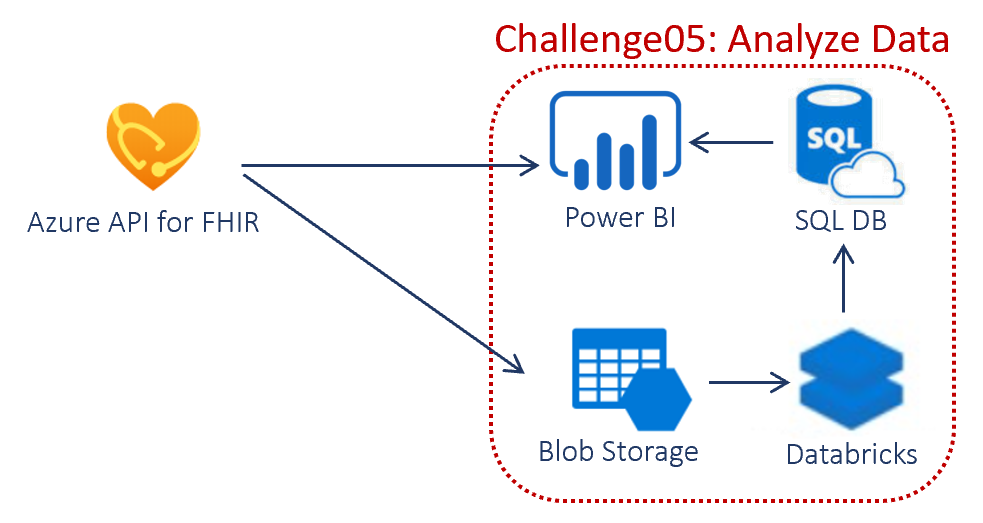

# Challenge05 - Analytics on FHIR Data

## Scenario
Now that you’ve loaded data into FHIR, let’s look at some possible ways to utilize FHIR data to draw out additional insights. Can we do some basic analysis of the COVID-related observations that lead toward respirators? How many of those with symptoms moved to respirators? How fast did they move from first symptoms to respirator? How long did they stay on respirators?

From a data analytics perspective, it can often be helpful to first structure the data so that is your first task. Data story we are investigating... looking for common patient observations in certain geographies... understand the data by visualizing it. 

## Reference Architecture

## To complete this challenge successfully, you will pick one option and will perform the following tasks.

### Option 1: Vizualize in PowerBI using PowerQuery Connector for FHIR. 
### Option 2: Vizualize in PowerBI using Azure SQL DB Connector.
   * **Process exported FHIR data using Databricks**. 
   * **Persist structured data into Azure SQL DB**.
   * **Vizualize in PowerBI using SQL Connector**.

## Before you start

* Make sure you have completed the pre-work covered in the previous challenge: [Challenge00 - Pre-requisites: Technical and knowledge requirements for completing the Challenges](../Challenge00-Prerequistes/ReadMe.md).

* Make sure you have completed [Challenge01 - Azure API for FHIR: Generate, Ingest and Store synthetic data into Azure API for FHIR](../Challenge01-AzureAPIforFHIR/ReadMe.md).

## Getting Started

## Option 1: Vizualize in PowerBI using PowerQuery Connector for FHIR.
* Go to **Secondary AD** tenant. 
   * Go to Azure AD, click on **Users**. Part of the [Challenge01](../Challenge01-AzureAPIforFHIR/ReadMe.md) deployment created an admin user {ENVIRONMENTNAME}-admin@{yournamefhirad}.onmicrosoft.com. 
   * Note down the **admin user and password**. If you don't remember the password, click Reset password. You will get a temporary password you can use to change the password the next time you login.
   * Click on the user and note down the **Object ID** of the user.
* **1.1 Create from scratch**
   * Open PowerBI Desktop. [Download](https://powerbi.microsoft.com/en-us/downloads/) if you don't have one.
   * Go to **File** --> **Options and settings** --> **Data source settings** and click **Clear All Permissions**.
   * Click **Get Data** from the menu.
   * Search **FHIR**, select the result, and click **Connect**.
   * Enter your FHIR URL **https://{your resource prefix}.azurehealthcareapis.com**. You can get this from [Challenge01](../Challenge01-AzureAPIforFHIR/ReadMe.md).
   * Click the **Sign In** button.
   * Enter **admin user from Secondary tenant and password**.
   * Click **Connect**.
   * Choose the tables you are interested in analyzing and click the **Transform data** button.
   * You should see all tables you selected are loaded into Power Query Editor.
   * Here are couple links to get you started: [PowerBI](https://docs.microsoft.com/en-us/power-bi/fundamentals/power-bi-overview) and [PowerQuery](https://docs.microsoft.com/en-us/power-query/power-query-what-is-power-query).
   * Put on your analyst hat and explore/transform/visualize!
* **2.2 Use pre-built template**
   * **NOTE**: Depending on the data you loaded into FHIR in previous challenges you completed, you might have more or less fields than what's in the example below.
   * Open the example [PowerBI PowerQuery Connector Template](./PowerBI%20-%20PowerQuery%20Connector%20for%20FHIR.pbix).
   * Enter **FHIR Server URL** **https://{your resource prefix}.azurehealthcareapis.com**. You can get this from [Challenge01](../Challenge01-AzureAPIforFHIR/ReadMe.md). 
   * Click the **Load** button.
   * Sign-in using **admin user from Secondary tenant and password** and click **Connect**.
   * Refresh time depends on volume of data in your Azure API for FHIR.
   * Put on your analyst hat and explore/transform/visualize!
   * Save by clicking File --> Save.

## Option 2: Vizualize in PowerBI using Azure SQL DB Connector.
## Task #1: Process and Load FHIR data into Azure SQL Database using Azure Databricks
* Create **Azure SQL Environment**
   * Go to the Azure portal and search for **SQL databases**. Click the **Add** button.
   * Provide a new Resource Group name, **Database name**.
   * Provide a **Server**, **Server admin login** and **Password**. Make sure you remember these credentials since you will need this in the next Task #2 below.
   * Click Configure database in **Compute + storage** and choose **Serverless**. Make sure the **Enable auto-pause** option is checked.
   * Click **Create** button.
   * Once the deployment is complete, open your SQL Database, and click on **Query editor** on the left.
   * Enter the **Login and Password** from above.
   * If you get the error "Client with IP address is not allowed to access the server", click on the link or Go to SQL Server, Firewalls and virtual networks and add Client IP listed there.
   * Copy the [SQL DDL Script](./SQL%20DDL%20Script.txt). Paste the value in the Editor and **Run**. Confirm 12 tables were created in the database.
   * If you want to use SQL Server Data Tools (SSDT) or SQL Server Management Studio (SSMS), take note of the Server name from Overview and add Client IP in Firewalls and virtual networks.
* **Export Data** using Postman
   * **NOTE**: To get the latest data from Azure API for FHIR, follow the below steps to export data from Azure API for FHIR into **Export Storage Account** created in Challenge01.
   * Go to the Azure portal. Navigate to the Resource group deployed in [Challenge01](../Challenge01-AzureAPIforFHIR/ReadMe.md). Click on the Azure API for FHIR resource. Click on **Integration** under Settings on the left. Note down the **Export Storage Account name**.
   * If you haven't done setting up Postman in [Challenge01](../Challenge01-AzureAPIforFHIR/ReadMe.md), go back and complete that. 
   * Open **AuthorizeGetToken SetBearer** request in FHIR Hack folder, choose "FHIR Hack" in environments drop-down and Click Send. This will set the Bearer Token to the variable.
   * Open **Export** request in FHIR Hack folder and Click Send. This should export FHIR data into a Storage account.
   * Go to **Export Storage Account name**, get the name of the **Storage Account**, **Storage Account Key** from Access Keys and **Container name** that was just created.
   * Make a **list of the .ndjson files** in that Container.
* Create **Databricks** Environment
   * Go to the Azure portal. Search for **Azure Databricks**. Click Add. 
   * Create or use the same Resource group as Azure SQL. Enter **Workspace name**, choose the same Location as Azure SQL. Click Create.
   * Once the deployment is complete, Click on **Launch Workspace**.
   * Click Clusters on the left and **Create Cluster**, default settings should be ok. Make sure **Terminate** is enabled.
   * Click Workspace on the left. Click on down-arrow next to Workspace and **Import**. Download [Databricks Notebook](./fhirhackdatabrickstemplate.dbc) and Upload or Browse and click Import. **NOTE:** This notebook has code for all files that will be created in all challenges. If you are doing this challenge before completing all challenges, you won't have all .ndjson files in the Export Container. **Comment** out the code for the files that don't exist and **uncomment** when you complete all challenges.
   * Search for **<** and 
      * Update **storage account name, storage account key** in **Cmd 3** 
      * Update **container name** in **Cmd 7** from the Step above
      * Update **sqlservername, sqldatabasename, user and password** in **Cmd 11**
   * Start and attach your cluster.
   * Click **Run All**.
   * Go to **Query Editor** in the SQL DB you created and check if all 12 tables have data.

## Task #2: Visualize in PowerBI using Azure SQL Server 
* **2.1 Create from scratch**
   * NOTE**: If you created **SQL Database Serverless** in Task #1 above, and have the default Auto-pause enabled, make sure the SQL Database is Online by connecting using one of the tools like Query editor in Portal, SSMS, SSDT... before proceeding.
   * Open PowerBI Desktop. [Download](https://powerbi.microsoft.com/en-us/downloads/) if you don't have one.
   * Go to **File** --> **Options and settings** --> **Data source settings** and click **Clear All Permissions**.
   * Click **Get Data** from the menu.
   * Search **Azure SQL**, select and click Connect.
   * Enter **SQL Server name** and ** SQL Database name** from Task #1 above. Leave Import checked. Click the **Ok** button.
   * Click Database on the left menu. Type in User name and Password from Task #1 above.
   * Choose all the tables you are interested in analyzing/visualizing and click Transform data.
   * Here are couple links to get you started: [PowerBI](https://docs.microsoft.com/en-us/power-bi/fundamentals/power-bi-overview) and [PowerQuery](https://docs.microsoft.com/en-us/power-query/power-query-what-is-power-query).
   * Put on your analyst hat and explore/transform/visualize!
* **2.2 Use pre-built template**
   * Open the template [PowerBI SQL Connector Template](./PowerBI%20-%20SQL%20Connector.pbit).
   * Enter **SQL Server name** and **SQL Database name** from Task #1 above, in the popup. Click the **Load** button.
   * Choose **Database** in the left menu. Enter the SQL Server **User name** and **Password** and click **Connect**.
   * Refresh time depends on volume of data in your SQL Server.
   * Put on your analyst hat and explore/transform/visualize!
   * Save by clicking File --> Save.

## Task #3: Clean Up Resources
* **Pause/Disable/Stop** Azure resources created above if you are NOT going to use it immediately
* **Delete** Azure resources created above if you DON'T need them anymore
* **Disable** Data Export in IoT Central

## Congratulations! You have successfully completed Challenge05!

## Help, I'm Stuck!
* Below are some common setup issues that you might run into with possible resolution. If your error/issue is not here, please let your coach know.

***

