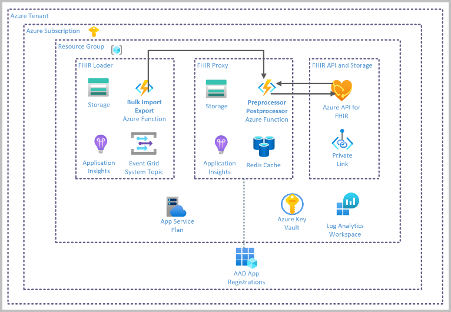

# Challenge1 - Deploy FHIR-Starter Quickstart

## Background

FHIR® (Fast Healthcare Interoperability Resources) is an industry standard for health data storage and exchange. Microsoft is strategically adopting FHIR as the standard format for health data storage and exchange in the Microsoft health data platform.

The **[Azure API for FHIR](https://docs.microsoft.com/en-us/azure/healthcare-apis/azure-api-for-fhir/overview)**
is a managed, standards-based, compliant API that enables rapid exchange of data through Fast Healthcare Interoperability Resources (FHIR®) APIs, backed by a managed Platform-as-a Service (PaaS) offering in the cloud. The persistence of all FHIR data is also managed within the service. 

This challenge is based on the **[FHIR-Starter Quickstart](https://github.com/microsoft/fhir-starter/tree/main/quickstarts)**, which deploys the following Open Source Software (OSS) projects along with the Azure API for FHIR:

* [FHIR Proxy](https://github.com/microsoft/fhir-proxy): a secure FHIR Gateway and Proxy that wraps the Azure API for FHIR with an intelligent checkpoint capable of filtering based on admin-defined rules
* [Bulk Loader & Export](https://github.com/microsoft/fhir-loader): enables bulk import and export to and from the Azure API for FHIR

## Reference Architecture

## To complete this challenge successfully, you will perform the following tasks.

* **Deploy an ARM template** in Azure, which provisions:
   * Azure API for FHIR (PaaS)
   * FHIR Proxy (OSS)
   * FHIR Loader & Exporter (OSS)
* **Configure Authentication** for the FHIR Proxy
* **Configure App Roles and API Permissions** for the FHIR Proxy

## Prerequsites

1. **If you haven't completed [Challenge0](../Challenge0-Prerequistes/ReadMe.md), complete them now.**
2. The following resource providers must be registered in your subscription. To check, go to Subscriptions, click Resource providers in the left navigation. Then filter by name
   * Resources
   * KeyVault
   * Healthcare APIs
   * Insights
   * Web
   * Cache
   * Storage
   * EventGrid
   * AlertsManagement
3. You must deploy to a region that supports Azure API for FHIR.  You can use the [product by region page](https://azure.microsoft.com/en-us/global-infrastructure/services/?products=azure-api-for-fhir) to verify your destination region. 

## Deployment
1. In Azure Portal, create a new Resource group **{fhirtrainingname}**, selecting your deployment Region.

2. In a new browser tab, navigate to the [FHIR-Starter Quickstart on Github](https://github.com/microsoft/fhir-starter/tree/main/quickstarts), complete the instructions using the following parameters:
   * Resource group: **{fhirtrainingname}**
   * Region: same used to create the Resource group
   * Deployment prefix: **{prefix}**
   * Enable Transform Bundle: **true**
   * All other feature enable options: **false**

> https://github.com/microsoft/fhir-starter/tree/main/quickstarts

3. Return here when complete. 

> NOTE: The Quickstart deployment will take ~20 minutes. 

## Validate Deployment

| Name | Type | Used by | Purpose |
|---|---|---|---|
| [prefix]**asp** | App Service plan | Shared | Shared by Proxy & Loader function apps |
| [prefix]**cr** | Container registry | FHIR Proxy | Used by $convert   function in FHIR Proxy |
| [prefix]**fhir** | Azure API for FHIR | Azure API for FHIR | Azure Managed API and stateful data repository |
| [prefix]**fssa** | Storage account | Shared | Used by $export function of Azure API for FHIR and Event Grid System Topics for audit/errors in FHIR Loader |
| [prefix]**funsa** | Storage account | Shared | Stores code for FHIR Proxy and FHIR Loader functions |
| [prefix]**kv** | Key vault | Shared | Manages secrets and   some application configuration settings |
| [prefix]**la** | Log Analytics workspace | Shared | Logs activities from   all components |
| [prefix]**ldrai** | Application Insights | FHIR Loader | Monitors FHIR Loader application |
| [prefix]**ldrfa** | Function App | FHIR Loader | FHIR Loader functions |
| [prefix]**ldrtopic** | Event Grid System Topic | FHIR Loader | Triggers processing of FHIR bundles placed in the [prefix]fssa storage account |
| [prefix]**pxyai** | Application Insights | FHIR Proxy | Monitors FHIR Proxy application |
| [prefix]**pxyfa** | Function App | FHIR Proxy | FHIR Proxy functions |
| [prefix]**rc** | Azure Cache for Redis | FHIR Proxy | Improves performance of some specific scenarios in FHIR Proxy |

1. Go to Azure Portal, and open the **{fhirtrainingname}** you deployed into:
   * confirm the above 13 resources were deployed
   * click the **Deployments** link, and review the **Microsoft.Template-[datetimestamp]** deployment details to ensure there are no errors
2. Go to App Registrations, open the application ending in **pxyfa**, go to API permissions and confirm the following are configured:
   * **user_impersonation** to **Azure Healthcare APIs**
   * **User.Read** to **Microsoft Graph**

## Clean-up
If you are not planning to continue with the other challenges, make sure to delete these to avoid cost in Azure
1. Resource Group **{fhirtrainingname}**
2. App Registration [prefix]**pxyfa**

---

## Congratulations! You have successfully completed Challenge1! 

***

[Go to Challenge2](../Challenge2-AuthSetup/ReadMe.md)

