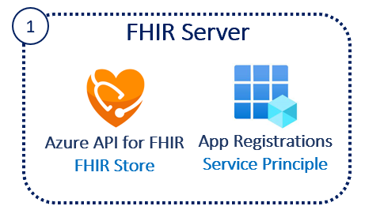

# Challenge1 - FHIR Server

Azure API for FHIR is a managed, standards-based, compliant API that enables rapid exchange of data through Fast Healthcare Interoperability Resources (FHIR®) APIs, backed by a managed Platform-as-a Service (PaaS) offering in the cloud.

This challenge is based off **[FHIR Starter](https://github.com/sordahl-ga/api4fhirstarter#azure-api-for-fhir-starter)**, click to get more details.

You will deploy an Azure API for FHIR Instance and Register a Service Client for Access.

## Reference Architecture
<center></center>

## To complete this challenge successfully, you will perform the following tasks.

* **Deploy Azure API for FHIR**. 
* **Register a Service Client** and securely store the secrets in Keyvault.
* **Validate connectivity** using Postman.

## Prerequsites

1. **If you haven't completed [Challenge0](../Challenge0-Prerequistes/ReadMe.md), complete them now.**
2. The following resource providers must be registered in your subscription:
   * ResourceGroup
   * KeyVault
   * Azure API for FHIR
3. You must deploy to a region that supports Azure API for FHIR.  You can use the [product by region page](https://azure.microsoft.com/en-us/global-infrastructure/services/?products=azure-api-for-fhir) to verify your destination region. 

# Deployment
1. [Open Azure Cloud Shell](https://shell.azure.com) you can also access this from [Azure Portal](https://portal.azure.com)
2. Select Bash Shell for the environment 
3. If you have multiple tenants, set the right tenant ```az account set --s {subscriptionid or tenantid}```
4. Clone this repo ```git clone https://github.com/sordahl-ga/api4fhirstarter```
5. Change directory ```cd api4fhirstarter```
6. Make the bash script executable ```chmod +x ./createapi4fhir.bash```
7. Execute ```createapi4fhir.bash -p``` by following the prompts
   **Note** -p creates a Postman Envirnment file which you can download
   * Subscription ID 
   * New Resource Group Name
   * New Resource Group Location 
   * New Key Vault Name 
   * New unique name for Azure API for FHIR 
8. Download the **{azureapiforfhirname}.postman_environment.json** and **FHIR-CALLS-Sample.postman-collection.json** files that was created by the deploy script above in the same folder

# Validate Deployment
1. Go to Azure Portal, and check if Resource Group **{azureapifhirname}** is created
2. Check if **Azure API for FHIR** is created in the same Resource Group
3. Check if Service Client **{azureapiforfhirname}-svc-client** is created in App Registrations
4. Check if Key Vault **{azureapiforfhirname}kv** is created in the same ResourceGroup. Check if 5 secrets with prefix FS- are created. These secrets have the details of the Service Client created

# Validate Connectivity to FHIR Server using Postman
1. Open Postman
2. Create a New Workspace from Workspaces menu
3. Select the Import button next to your workspace name
4. Upload the 2 files downloaded above using the upload file button 
5. Select the **AuthorizationGetToken** call from the **FHIR Calls-Sample** collection
6. Select the **{azureapiforfhirname}** postman environment in the top-right drop-down. 
8. Click Send you should receive a valid token, this will be automatically set in the bearerToken variable for the environment
9. Select the **List Patients** call from the **FHIR Calls-Samples** collection
10. Click Send and you should receive an empty bundle of patients from the FHIR Server
Note: After token expiry, use the ```AuthorizationGetToken``` call to get another token

---

## Congratulations! You have successfully completed Challenge1! 

***

[Go to Challenge2](../Challenge2-FHIRProxy/ReadMe.md)

