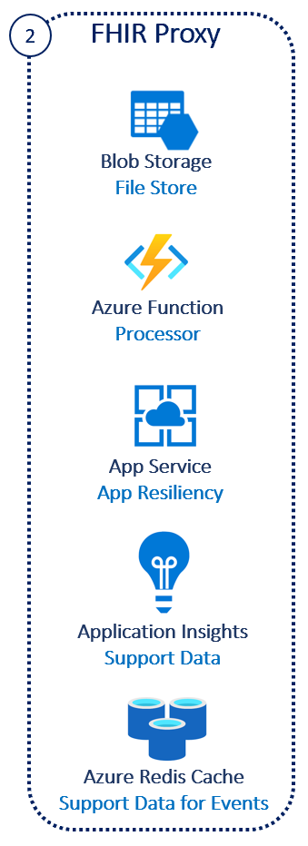

# Challenge2 - FHIR Proxy

FHIR Proxy is a secure FHIR gateway, an Azure Function based solution that:
* Acts as an intelligent and secure gateway to FHIR Servers
* Allows multi-tenant access and purpose driven security policies specialized access to a common FHIR Server
* Provides a consolidated approach to pre and post processing of FHIR Server Calls to support various access and result filtering or actions.
* Is integrated with Azure Active Directory for authentication and to provide Role based access control.
* Acts as a FHIR specific reverse proxy rewriting responses and brokering requests to FHIR Servers

This challenge is based off **[FHIR Proxy](https://github.com/microsoft/fhir-proxy)**, click to get more details.

You will be deploying an Azure Function, supporting Azure services and Service Client for Access.

## Reference Architecture
<center></center>

## To complete this challenge successfully, you will perform the following tasks.

* **Deploy Azure Function and related services**. 
* **Register a Service Client** and securely store the secrets in Keyvault.
* **Validate connectivity** using Postman.

## Prerequsites

1. **If you haven't completed [Challenge1](../Challenge1-FHIRServer/ReadMe.md), complete now.**
2. The following resource providers must be registered in your subscription:
   * Insights
   * App Service Plan
   * Cache
   * Storage
   * EventGrid
3. Go to the KeyVault **{azureapiforfhirname}kv** deployed in Challenge1, gather the secrets from:
   * FP-SC-RESOURCE 
   * FP-SC-CLIENT-ID 
   * FP-SC-CLIENT-SECRET 
   * FP-SC-TENANT-NAME 
   * FP-RBAC-NAME

## Deployment
1. [Open Azure Cloud Shell](https://shell.azure.com) you can also access this from [Azure Portal](https://portal.azure.com)
2. Select Bash Shell for the environment 
3. If you have multiple tenants, set the right tenant ```az account set --s {subscriptionid or tenantid}```
4. Clone this repo ```git clone https://github.com/microsoft/fhir-proxy```
5. Change directory ```cd ./fhir-proxy/scripts/```
6. Make the bash script executable ```chmod +x deployfhirproxy.bash```
7. Execute ```./deployfhirproxy.bash``` by following the prompts
   * Subscription ID 
   * Same Resource Group Name used in Challenge1
   * Same Resource Group Location used in Challenge1
   * A prefix {azureapiforfhirname}p
   * Same Key Vault Name used in Challenge1
   * New unique name for Proxy App {azureapiforfhir}papp
8. Make the bash script executable ```chmod +x createproxyserviceclient.bash```
7. Execute ```./createproxyserviceclient.bash``` by following the prompts
   * Same Key Vault Name used in Challenge1
   * New unique name for Proxy Service Principle {azureapiforfhir}p-svc-client

**NOTE: This deployment will take ~5-10 minutes**

## Validate Deployment
1. Go to Azure Portal, and check if these resources are created in the Resource Group **{azureapifhirname}**
   * {azureapiforfhir}papp Function App
   * {azureapiforfhir}papp Application Insights
   * {azureapiforfhir}papp App Service Plan
   * {azureapiforfhir}pcache... Azure Cache for Redis
   * {azureapiforfhir}pstore... Storage Account
2. Check if Service Client **{azureapiforfhirname}p-svc-client** is created in App Registrations
3. Check the Key Vault **{azureapiforfhirname}kv** for 7 new secrets with prefix FP- and 4 new secrets with prefix FP-SC-. These secrets have the details of the Service Client created

## Post-Deployment 
1. Go to App Registrations
2. Search and click on **{azureapiforfhirname}p-svc-client**
3. Go to API permissions and Grant admin consent 

## Validate Connectivity to FHIR Server using Postman
1. Open Postman
2. Go to the Workspace created in Challenge1
3. Go to Environment and find the **{azureapiforfhirname}** environment imported in Challenge1
4. Click ... and Duplicate. Rename to **{azureapiforfhirname}proxy**
5. Click on **{azureapiforfhirname}proxy** and update the Initial and Current Values with these gathered from Challenge 1:
   * tenantid: FP-SC-TENANT-NAME
   * clientid: FP-SC-CLIENT-ID
   * clientSecret: FP-SC-CLIENT-SECRET
   * fhirurl: FP-RBAC-NAME/fhir **NOTE** Append /fhir
   * resource: FP-SC-RESOURCE
6. Select the **AuthorizationGetToken** call from the **FHIR Calls-Sample** collection 
7. Select the **{azureapiforfhirname}proxy** postman environment in the top-right drop-down. 
8. Click Send you should receive a valid token, this will be automatically set in the bearerToken variable for the environment
9. Select the **List Patients** call from the **FHIR Calls-Samples** collection
10. Click Send and you should receive an empty bundle of patients from the FHIR Server
Note: After token expiry, use the **AuthorizationGetToken** call to get another token

## Clean-up
If you are not planning to continue with the other challenges, make sure to delete these to avoid cost in Azure
1. Resource Group **{azureapifhirname}**
2. Service Client **{azureapiforfhirname}p-svc-client**

---

## Congratulations! You have successfully completed Challenge2! 

***

[Go to Challenge3](../Challenge3-FHIRLoader/ReadMe.md)

