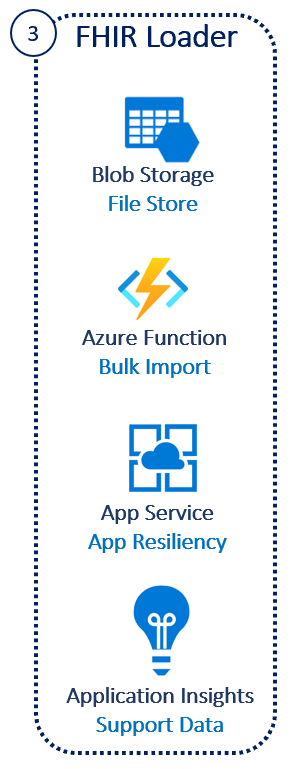

# Challenge3 - FHIR Loader

FHIR Bulk Loader is an Azure Function App solution that provides the following services for ingesting FHIR Resources into the FHIR Server:
   * Imports FHIR Bundles (compressed and non-compressed) and NDJSON files into FHIR Server
   * High Speed Parallel Event Grid triggers from storage accounts or other event grid resources.
   * Complete Auditing, Error logging and Retry for throttled transactions

This challenge is based off **[FHIR Loader](https://github.com/microsoft/fhir-loader)**, click to get more details.

You will be deploying an Azure Function and supporting Azure services.

## Reference Architecture
<center></center>

## To complete this challenge successfully, you will perform the following tasks.

* **Deploy Azure Function and related services**. 
* **Validate data load** using Postman.

## Prerequsites

1. **If you haven't completed [Challenge2](../Challenge2-FHIRProxy/ReadMe.md), complete now.**

## Deployment
1. [Open Azure Cloud Shell](https://shell.azure.com) you can also access this from [Azure Portal](https://portal.azure.com)
2. Select Bash Shell for the environment 
3. If you have multiple tenants, set the right tenant ```az account set --s {subscriptionid or tenantid}```
4. Clone this repo ```git clone https://github.com/cyberuna/fhir-loader```
5. Change directory ```cd ./fhir-loader/scripts/ ```
6. Make the bash script executable ```chmod +x deployFhirBulkLoader.bash ```
7. Execute ```./deployFhirBulkLoader.bash -y``` -y is for proxy access, by following the prompts
   * Subscription ID 
   * Same Resource Group Name used in Challenge1
   * Same Resource Group Location used in Challenge1
   * A prefix {azureapiforfhirname}l
   * Same Key Vault Name used in Challenge1
8. Copy the Loader Function name displayed at the end of the deployment

**NOTE: This deployment will take ~10-15 minutes**

## Validate Deployment
1. Go to Azure Portal, and check if these resources are created in the Resource Group **{azureapifhirname}**
   * sfload... Function App
   * sfload... Application Insights
   * {azureapiforfhir}lasp App Service Plan
   * {azureapiforfhir}lstore... Event Grid System Topic
   * {azureapiforfhir}lstore... Storage Account

## Load data
1. [Download](../SampleData) Synthetic data generated by Synthea.
2. Upload sample data
   * Go to the {azureapiforfhir}lstore... Storage Account
   * Click Containers and then click bundles
   * Click Upload, select the files downloaded by click on the blue folder icon
   * The files should appear in the center area. As these are small files, they will upload fast and disappear from the center area.
   * Go back to Containers and click on bundlesprocessed and the files should appear there

## Validate data loaded into FHIR Server using Postman
1. Open Postman
2. Go to the Workspace created in Challenge1
3. Go to Environment and find the **{azureapiforfhirname}proxy** environment created in Challenge2
4. Select the **AuthorizationGetToken** call from the **FHIR Calls-Sample** collection 
7. Select the **{azureapiforfhirname}proxy** postman environment in the top-right drop-down. 
8. Click Send you should receive a valid token, this will be automatically set in the bearerToken variable for the environment
9. Select the **List Patients** call from the **FHIR Calls-Samples** collection
10. Click Send and you should receive patients that you uploaded into the Storage Account that are now loaded into the FHIR Server
Note: After token expiry, use the **AuthorizationGetToken** call to get another token

## Clean-up
If you are not planning to continue with the other challenges, make sure to delete these to avoid cost in Azure
1. Resource Group **{azureapifhirname}**

---

## Congratulations! You have successfully completed Challenge3! 

***

[Go to Challenge4](../Challenge4-FHIRSyncAgent/ReadMe.md)

