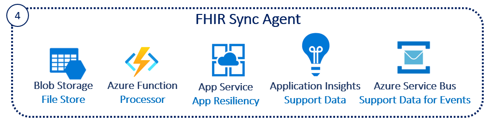

# Challenge4 - FHIR Sync Agent

FHIR-SyncAgent sychronizes health data between Azure API for FHIR and Dataverse' Microsoft Cloud for Healthcare securely and seemlessly. Applications built on the Dynamics platform (which includes Dynamics model-driven applications) that uses Dataverse can operate without the need to make REST API calls directly against Azure API for FHIR. 

This challenge is based off **[FHIR Sync Agent](https://github.com/microsoft/fhir-cds-agent)**, click to get more details.

You will be deploying an Azure Function and supporting Azure services including the Service Client for Access.

## Reference Architecture
<center></center>

## To complete this challenge successfully, you will perform the following tasks.

* **Register a Service Client** in Azure tenant that is same as Dynamics 365 tenant.
* **Deploy Azure Function and related services**. 
* **Validate deployment**.

## Prerequsites

1. **If you haven't completed [Challenge3](../Challenge3-FHIRLoader/ReadMe.md), complete now.**
2. The following resource providers must be registered in your subscription. To check, go to Subscriptions, click Resource providers in the left navigation. Then filter by name
   * Function App
   * Application Insights
   * App Service Plan
   * Service Bus Namespace
   * Storage Account
3. Go to Challenge2, gather these details for below deployment:
   * FHIR Proxy Function App Name

## Setup App Registration in the same Azure tenant as your Dynamics 365 tenant
1. Go to App Registrations in Azure Portal
2. Click + New registration
3. Enter a Name **syncdv-svc-client**, pick Single tenant, click Register
4. Go to Certificates & secrets in the left navigation, click + New client secret, click Add
5. The details of this App Registration will be stored in Key Vault secrets **{azureapiforfhirname}kv** as part of the deployment below
   * SA-CDSCLIENTID
   * SA-CDSSECRET
   * SA-CDSTENANTID
   * SA-CDSAUDIENCE

## Deployment
1. [Open Azure Cloud Shell](https://shell.azure.com) you can also access this from [Azure Portal](https://portal.azure.com)
2. Select Bash Shell for the environment 
3. If you have multiple tenants, set the right tenant ```az account set --s {subscriptionid or tenantid}```
4. As this is a private repository, follow these steps:
   * Go to the Github https://github.com/cyberuna/fhir-cds-agent. 
   * Click on Account (your picture on the top right corner), then click on Settings. 
   * Click Developer Settings in left menu
   * Click Personal access tokens
   * Click Generate new token 
   * Click Enable SSO and click Authorize against microsoft.
6. Clone this repo ```git clone https://github.com/cyberuna/fhir-cds-agent```, Enter your Github username, and token for password.
7. Change directory ```cd ./fhir-cds-agent/scripts```
8. Make the bash script executable ```chmod +x deploysyncagent.bash```
9. Execute ```./deploysyncagent.bash``` by following the prompts
   * Subscription ID 
   * Same Resource Group Name used in Challenge1
   * Same Resource Group Location used in Challenge1
   * A prefix {azureapiforfhirname}s
   * Same Key Vault Name used in Challenge1
   * New unique name for Proxy App {azureapiforfhir}sapp
10. Make the bash script executable ```chmod +x setupSyncAgent.bash```
11. Execute ```./setupSyncAgent.bash``` by following the prompts
   * FHIR Proxy Function App Name from Challenge2
   * Same Resource Group Name used in Challenge1
   * Same Key Vault Name used in Challenge1
   * Dynamics 365 URL from Setup above
   * Tenant ID from Setup above
   * Client ID from Setup above
   * Client Secret from Setup above

**NOTE: This deployment will take ~10-15 minutes**

## Validate Deployment
1. Go to Azure Portal, and check if these resources are created in the Resource Group **{azureapifhirname}**
   * {azureapiforfhir}sapp Function App
   * {azureapiforfhir}sapp Application Insights
   * {azureapiforfhir}sapp App Service Plan
   * {azureapiforfhir}sbns... Service Bus Namespace
   * {azureapiforfhir}sstore... Storage Account
2. Check the Key Vault **{azureapiforfhirname}kv** for 10 new secrets with prefix SA-. 

## Post-Deployment 
1. Go to the Proxy **{azureapiforfhir}papp** Function App, click on Configuration in the left navigation, make sure all Key vault Reference in source column in center section are all green. Click **Refresh** few times in your see reds.
2. Go to the Sync Agent **{azureapiforfhir}sapp** Function App, click on Configuration in the left navigation, make sure all Key vault Reference in source column in center section are all green. Click **Refresh** few times in your see reds. 
3. Go to the Sync Agent **{azureapiforfhir}sapp** Function App, click on Functions in the left navigation, click on FHIRUpdates in the center, click Integration in the left navigation, click on Azure Service Bus (message) in in the center under the Trigger, enter fhirupdates in the Queue Name on the right and click Save. **NOTE If you don't see any Functions listed, Go to Configuration and set the value 0 to WEBSITE_RUN_FROM_PACKAGE**. Restart the Function App.

## Clean-up
If you are not planning to continue with the other challenges, make sure to delete these to avoid cost in Azure
1. Resource Group **{azureapifhirname}**
---

## Congratulations! You have successfully completed Challenge4! 

***


[Go to Challenge5](../Challenge5-FHIRSyncDV/ReadMe.md)

