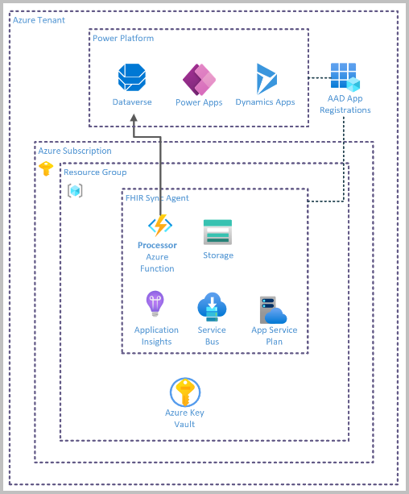

# Challenge5 - Configure FHIR Sync Integration in Dataverse

Microsoft Cloud for Healthcare provides capabilities to manage health data at scale and make it easier for healthcare organizations to improve the patient experience, coordinate care, and drive operational efficiency, while helping support security, compliance, and interoperability of health data.

## Reference Architecture

FHIR Sync Agent includes two primary components:

1. **FHIR Sync Agent** service (Azure)
   * consists of Azure services that are deployed directly within your Azure Subscription
2. **Sync admin for FHIR application** (Power Platform Dataverse)
Both components are required in order for clinical information to properly flow between Azure API for FHIR and Dataverse.
   * deployed automatically when you deploy any of the Microsoft Cloud for Healthcare healthcare solutions through the Microsoft Cloud Solution Center

In this challenge you will focus on completing the Sync Agent integration within Dataverse using the **Sync Admin for FHIR application**. 

## To complete this challenge successfully, you will perform the following tasks.

* **Configure an App User** in Dataverse for the Service Client created in Challenge4. 
* **Configure Sync Agent Integration** settings in the Sync Admin for FHIR app in Dataverse, 
* **Enable default Entity and Attribute Maps** for transformation from FHIR to the CDM in Dataverse.

## Prerequsites

1. **If you haven't completed [Challenge4](../Challenge4-FHIRSyncAgent/ReadMe.md), complete now.**
2. Deploy at least one [Microsoft Cloud for Healthcare](https://docs.microsoft.com/en-us/industry/healthcare/configure-cloud-for-healthcare#use-the-microsoft-cloud-solution-center-for-setup) solution in your Dynamics 365 environment.

## Register and Add Roles for Application User in Dataverse
Reference [link](https://docs.microsoft.com/en-us/dynamics365/industry/healthcare/configure-sync-clinical-data#update-integration-settings)
1. Go to https://admin.powerplatform.microsoft.com/. 
   * Click on your environment. 
   * Click on **See All under S2S Apps**. 
   * Click **+ New app user**. 
   * Choose the **Business unit**. 
   * Click **+ Add an app**. Search for **App Registration Name** created in Challenge 4. Click **Add**.
   * Click **Edit** (pencil icon) icon next to **Security roles**. Choose the below roles and click **Save**.
      * FHIR Sync Agent Config Administrator 
      * FHIR Sync Agent App Reg User 
      * FHIR Sync Agent Healthcare User

## FHIR Sync Agent Administration App
Reference [link](https://docs.microsoft.com/en-us/dynamics365/industry/healthcare/configure-sync-clinical-data#use-fhir-sync-agent-administration)
1. Sign in to [Power Apps](https://make.powerapps.com/)
2. From the upper-right corner, select the environment where you deployed the FHIR Sync Agent.
3. In the left navigation pane, select Apps, and then select the FHIR Sync Agent Administration app.
4. In the left navigation pane, select Integration Settings, and make these changes:
   * Enable Integration: Slide to **On**
   * Enable Logging: Slide to **On**
   * Sync agent client ID: This is the value in secret SA-CDSCLIENTID in Key Vault **{azureapiforfhirname}kv**
   * Service bus URL: Go to the Service Bus Namespace **{azureapiforfhirname}ssbns** created in Challenge 4. Click on Overview in the left navigation, copy the **Host name** and paste here for Service bus URL. **NOTE: Make sure there is no / at the end of the URL**
   * Service queue: Enter **cdsupdates**
   * Service bus shared access policy: Enter **SyncAgentSharedAccessKey**
   * Service bus shared access policy key: Go to the Service Bus Namespace **{azureapiforfhirname}ssbns** created in Challenge 4. Click on **Shared access policies** in the left navigation, click on **SyncAgentSharedAccessKey** in the center, copy the **Primary Key** and paste here for **Service bus shared access policy key**
   * Click **Save**. **NOTE: If Save is disabled even after updating all fields, you have older version of the solution. Upgrade the solution**

## Configure Entity and Attributes Maps in Dataverse
> NOTE: A set of default Entity and Attribute maps are deployed out of the box with the Sync Admin for FHIR application, configured based on the FHIR US Common Core standard. In this exercise, you will enable and use a few of these default maps with US Common Core formatted Synthea data.  
 
For more information on the default maps, the JSONPath syntax used, and how to modify or create maps, review the  
1. Sign in to [Power Apps](https://make.powerapps.com/)
2. From the upper-right corner, select the **environment** where you deployed the FHIR Sync Agent.
3. In the left navigation pane, select **Apps**, and then select **Sync Admin for FHIR** app.
4. In the left navigation pane, select **Entity Maps**. In the center area, you will see entity maps listed
5. Ensure the three Patient Code entity maps for Entity Names **contact, msemr_medicalidentifier, msemr_contactlink** are enabled, with **Write Back to FHIR** also enabled. You can utilize Bulk Edit to do this:
   * Click the down arrow on the **Code (Azure FHIR Resource)** column to sort by this column to easily find the 3 patient entity maps
   * Click in the left most column for each of the 3 patient entity maps to select with a checkmark:
      * contact
      * msemr_medicalidentifier
      * msemr_contactlink
   * Click **Edit** on the top menu
      * ***NOTE:** this is a bulk edit form, and will not show any data in the individual fields for this reason. Only edit the fields you want to update on the individual records.*
      * Set **Is Disabled?** to **No**
      * Set **Enable Write Back to FHIR** to **No**
      * Click **Save**
6. Ensure all other entity maps are disabled. Repeat the process in step 5 to bulk edit all the remaining entity maps to set **Is Disabled?** to **Yes** if necessary. The **Enable Write Back to FHIR** setting does not need to be changed for these disabled entity maps.
   * **NOTE: SyncAgent will show errors if all entities are in fhirmappedresources keyvault secret but disabled here **
7. Restart **Sync Agent App in Azure** that was deployed in Challenge 4
   * **NOTE: mappting configuration changes in Dataverse will not currently take effect until the Sync Agent function app is restarted**

## Load data
1. [Download](../SampleDataForSync) Synthetic data generated by Synthea.
. Upload sample data
   * Open the **{prefix}fssa** storage account deployed in the **{fhirtrainingname}** resource group
   * Go to *Containers* and click into the **bundles** container
   * Click Upload, browse to the synthea files downloaded with the blue folder icon, select and Upload them.
   * The files should appear in the file list. As these are small files, they will upload fast and disappear upon refresh.
   * Go back to *Containers* and click into the **bundlesprocessed** and confirm the processed bundle files are there.
   * If the files appear in the **bundleserror** container instead, the bundles were not loaded and troubleshooting is required.

## Validate data loaded into FHIR Server using Postman
1. Open Postman and open the Workspace created in Challenge2. 
2. Set the *fhir-proxy* environment created in Challenge2 in the top-right.
3. Select the **AuthorizationGetToken** call from the **FHIR Calls-Sample** collection, and click Send if necessary to update an expired token. 
4. Select the **List Patients** call from the **FHIR Calls-Samples** collection, and click Send.
5. You should receive patients that you uploaded into the Storage Account that are now loaded into the FHIR Server
> NOTE: After token expiry, use the **AuthorizationGetToken** call to get another token

## Validate data loaded into FHIR Server and Synced into Dataverse
1. In the **Sync Admin for FHIR** app in Power Apps, click the **Sync Admin for FHIR** area label on the bottom left of the app and change the area **Healthcare Data**.
2. Go to **People** in the left navigation pane. 
4. Search for the Patient you just loaded into FHIR server in the list by sorting by **Azure FHIR Last Updated On**, or by typing the first name in **Search this view** on the top-right.
5. This Patient record has gone through all the resources that were deployed in all the challenges.

## Data Synced from Dataverse to FHIR
1. The field **Azure FHIR Sync Enabled** needs to be set to **Yes** on the Patient record that needs to be synced from Dataverse to FHIR. To do that:
   * Go to **Healthcare Administration** App
   * Click **People**
   * Choose the **Patients FHIR View**
   * Find the Patient record that you want to update and synced back to FHIR. In that field, update **Azure FHIR Sync Enabled** to Yes 
2. Restart the **Sync Agent App in Azure** that was deployed in Challenge 4.
3. Update the Patient record in Dataverse.
4. There will be an entry in **Sync Agent Logs** in **FHIR Sync Agent Administration App**.
5. Validate the Patient record in **Postman** by using the same instruction in Challenge 3.

---

## Congratulations! You have successfully completed Challenge5! 

---

