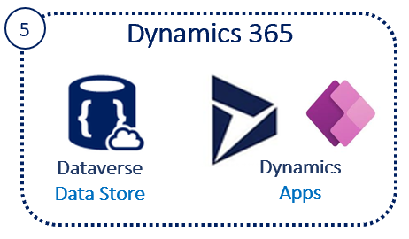

# Challenge5 - FHIR Sync to Dataverse

Microsoft Cloud for Healthcare provides capabilities to manage health data at scale and make it easier for healthcare organizations to improve the patient experience, coordinate care, and drive operational efficiency, while helping support security, compliance, and interoperability of health data.

## Reference Architecture

You will be setting up Dataverse in Dynamics 365 for Syncing data to and from Azure API for FHIR.

## To complete this challenge successfully, you will perform the following tasks.

* **Deploy Azure Function and related services**. 
* **Register a Service Client** and securely store the secrets in Keyvault.
* **Validate connectivity** using Postman.

## Prerequsites

1. **If you haven't completed [Challenge4](../Challenge4-FHIRSyncAgent/ReadMe.md), complete now.**
2. Deploy at least one [Microsoft Cloud for Healthcare](https://docs.microsoft.com/en-us/industry/healthcare/configure-cloud-for-healthcare#use-the-microsoft-cloud-solution-center-for-setup) solution in your Dynamics 365 environment.
3. Gather the secrets stored in Key Vault **{azureapiforfhirname}kv**
   * SA-CDSCLIENTID
   * SA-CDSSECRET
   * SA-CDSTENANTID
   * SA-CDSAUDIENCE

# Register and Add Roles for Application User in Dataverse
Reference [link](https://docs.microsoft.com/en-us/dynamics365/industry/healthcare/configure-sync-clinical-data#update-integration-settings)
1. Register the Client ID as Dataverse Application User. You can do this in one of the ways below:
   * Go to Settings/Security/Users/Application Users/+New app user, choose the org and the Sync Agent App Reg created. 
   * Go to Settings/Security/Users/Application Users in drop-down/+New/ApplicaitonUser, enter ClientID as ApplicationID and Save. 
2. To Add Roles, in the same page as Add user above, click Manage Roles and add to the App user created.
   * FHIR Sync Agent Config Administrator 
   * FHIR Sync Agent App Reg User 
   * Healthcare User  

# FHIR Sync Agent Administration App
Reference [link](https://docs.microsoft.com/en-us/dynamics365/industry/healthcare/configure-sync-clinical-data#use-fhir-sync-agent-administration)
1. Sign in to [Power Apps](https://make.powerapps.com/)
2. From the upper-right corner, select the environment where you deployed the FHIR Sync Agent.
3. In the left navigation pane, select Apps, and then select the FHIR Sync Agent Administration app.
4. In the left navigation pane, select Integration Settings, and make these changes:
   * Enable Integration: Slide to On
   * Enable Logging: Slide to On
   * Sync agent client ID: This is the value in secret SA-CDSCLIENTID in Key Vault **{azureapiforfhirname}kv**
   * Service bus URL: Go to the Service Bus Namespace **{azureapiforfhirname}ssbns** created in Challenge 4. Click on Overview in the left navigation, copy the Host name and paste here for Service bus URL
   * Service queue: Enter cdsupdates
   * Service bus shared access policy: Enter SyncAgentSharedAccessKey
   * Service bus shared access policy key: Go to the Service Bus Namespace **{azureapiforfhirname}ssbns** created in Challenge 4. Click on Shared access policies in the left navigation, click on SyncAgentSharedAccessKey in the center, copy the Primary Key and paste here for Service bus shared access policy key
   * Click Save

# Configure Entity Maps in Dataverse
1. Sign in to [Power Apps](https://make.powerapps.com/)
2. From the upper-right corner, select the environment where you deployed the FHIR Sync Agent.
3. In the left navigation pane, select Apps, and then select FHIR Sync Agent Administration app.
4. In the left navigation pane, select Entity Maps.
5. In the center area, you will see entities listed
   * Select Yes for Is Disabled for all entities except Entity Name contact that is assigned to Code (Azure FHIR Resource) Patient.
   * Select No for Enable Write Back to FHIR for all entities except Entity Name contact that is assigned to Code (Azure FHIR Resource) Patient.
   * Double-click on Entity Name contact that is assigned to Code (Azure FHIR Resource) Patient. You are in contact <-> Patient, Update Service Entity Map screen. Edit the 2 Attribute Names that have the value Not Applicable and select Yes for Disabled.

## Load data
1. [Download](../SampleDataForSync) Synthetic data generated by Synthea.
2. Upload sample data
   * Go to the {azureapiforfhir}lstore... Storage Account
   * Click Containers and then click bundles
   * Click Upload, select the files downloaded by click on the blue folder icon
   * The files should appear in the center area. As these are small files, they will upload fast and disappear from the center area.
   * Go back to Containers and click on bundlesprocessed and the files should appear there

## Validate data loaded into FHIR Server using Postman
1. Open Postman
2. Go to the Workspace created in Challenge1
3. Go to Environment and find the **{azureapiforfhirname}proxy** environment created in Challenge2
4. Select the **AuthorizationGetToken** call from the **FHIR Calls-Sample** collection 
7. Select the **{azureapiforfhirname}proxy** postman environment in the top-right drop-down. 
8. Click Send you should receive a valid token, this will be automatically set in the bearerToken variable for the environment
9. Select the **List Patients** call from the **FHIR Calls-Samples** collection
10. Click Send and you should receive patients that you uploaded into the Storage Account that are now loaded into the FHIR Server.
Note: After token expiry, use the **AuthorizationGetToken** call to get another token

## Validate data loaded into FHIR Server and Synced into Dataverse
1. Sign in to [Power Apps](https://make.powerapps.com/)
2. From the upper-right corner, select the environment where you deployed the FHIR Sync Agent.
3. In the left navigation pane, select Apps, and then select Healthcare Administration app.
4. Search for the Patient you just loaded into FHIR server by typing the first name in Search this view on the top-right.
5. This Patient record has gone through all the resources that were deployed in all the challenges.

---

## Congratulations! You have successfully completed Challenge5! 

---

***

