#  FHIR Sync Agent Debugging, Operations, and Maintenance

## Introduction
In this challenge you will learn to recoginize and address some of the issues that can happen with MC4H.  

## Background
The FHIR data store for Microsoft Cloud for Healthcare (MC4H) is **Azure API for FHIR**, while MC4H model-driven apps leverage the **Dynamics** health industry data model in **Dataverse**. Synchronizing data between FHIR and the Dataverse model requires several layers of mapping, most of which is set up and managed via the **SyncAdmin for FHIR** settings in Dynamics.

## Learning Objectives
+ Recognize and address some of the more common issues with integrating Azure and Dynamics  

## Prerequisites
Successful completion of all primary challenges:
* [Challenge0 - Pre-requisites](./Challenge0-Prerequistes/ReadMe.md)
* [Challenge1 - Deploy FHIR Components](./Challenge1-DeployFHIR/ReadMe.md)
* [Challenge2 - Configure Service Client Authorization](./Challenge2-AuthSetup/ReadMe.md)
* [Challenge3 - Bulk Load Synthea Data](./Challenge3-BulkLoad/ReadMe.md)
* [Challenge4 - Deploy FHIR Sync Agent](./Challenge4-FHIRSyncAgent/ReadMe.md)
* [Challenge5 - FHIR Sync to Dataverse Admin](./Challenge5-FHIRSyncDV/ReadMe.md)


---

## Step 1 - Enable Send and Receive Logging 
There are two approaches to troublshooting issues in MC4H. Either "You will use things to do stuff and then there will be stuff in Dataverse," or "Enable logging and follow the API calls." This step is about the latter. 

As noted in the [Challenge4 - Deploy FHIR Sync Agent](../Challenge4-FHIRSyncAgent/), there is a setting in the Application Configuration file that will enable greater logging detail.  

Name                                       | Value                      | Located 
-------------------------------------------|----------------------------|--------------------
AzureWebJobs.FHIRBulkLoad.Disabled         | 1                          | Disables the un-ordered Bulk Loader  
AzureWebJobs.FHIRNDJsonFileLoader.Disabled | 1                          | Disables the bootstrap Loader  
SA-LOGREQRESP                              | True                       | Additional logging

Once Enabled, you will be able to view detailed logging information at:

Function App -> Functions -> FHIRUpdate (update to Dataverse)

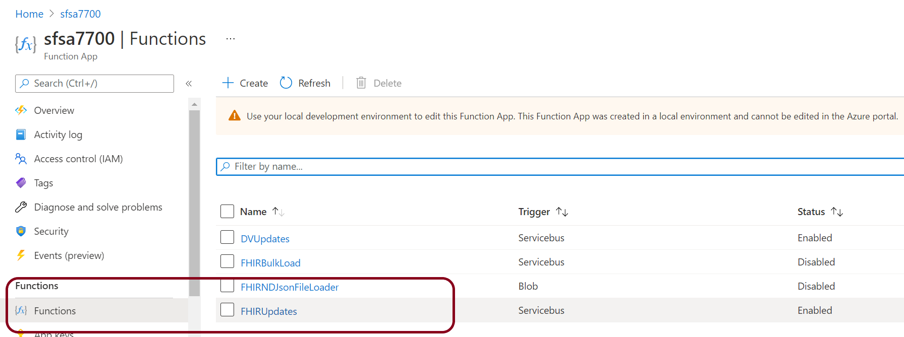


 -> Functions -> Monitor

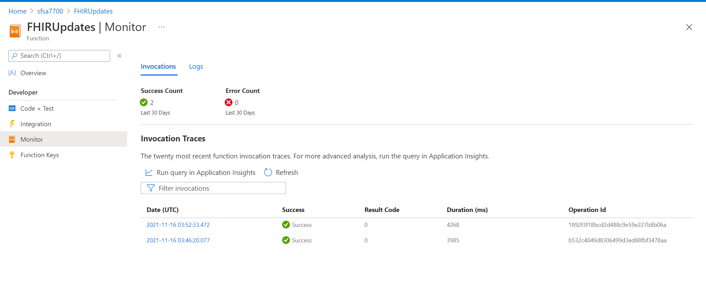


## Step 2 - Understanding the Messages 
Note the 403-Forbidden response from CDS in the picture below. This tells us that the application ID we are using is un-authorized to write to CDS (ie Dataverse).

Solution:  Contact your Dataverse administrator and have them update the Sync Agent Client ID for write access to DV **[link](https://docs.microsoft.com/en-us/dynamics365/industry/healthcare/configure-sync-clinical-data#update-integration-settings)** 
  
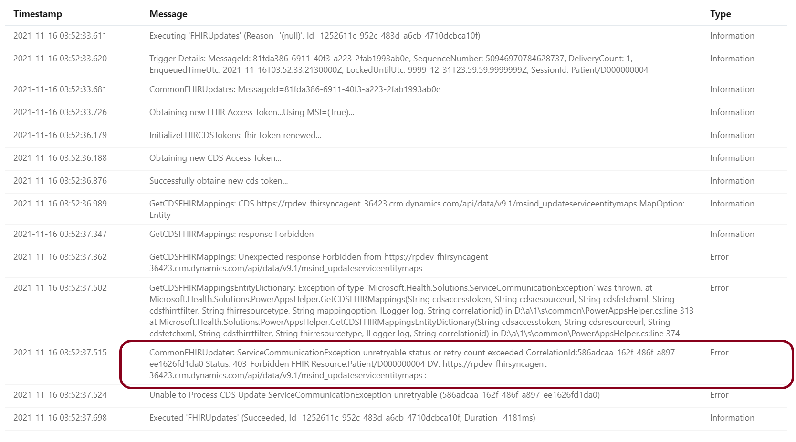


**Q:** Why does the monitor show Success even though there is an error in the file?  

**A:**  Technically the connection was a success. We sent a package and received a reply. Therefore the communication is deemed successful even through it may not have included the result you wanted.


## Step 3 - Testing from Postman 
The best method for testing FHIR to Dataverse is to start with Postman.  **Remember** data that is in FHIR will not automatically be sync'd to Dataverse once an Entity is enabled; rather, the data must be *updated* in the FHIR server to trigger a sync. This is due to the trigger function in the FHIR-Proxy:

+ FHIR data enters the FHIR-Proxy either via Bundle or HTTPS
+ The FHIR-Proxy performs any Pre-Process task (ie converting a Transaction Bundle into a Batch Bundle)
+ The FHIR-Proxy Post-Process _FHIRProxy.postprocessors.FHIRCDSSyncAgentPostProcess2_ send the MSG and Patient ID to the FHIR-SyncAgent for processing
+ The FHIR-SyncAgent calls the Dataverse API with the FHIR resource for processing 

You should have already loaded the MC4H Testing collection, here is the link again: [MC4H Testing.postman_collection.zip](./samples/MC4H_Testing.postman_collection.zip)  

The Patient Data in the MC4H Testing collection is structured in a way to help you track the users you create by ID. In this example we are creating a Patient with a known ID that we can track.

```al
PUT {{fhirurl}}/Patient/D000000001
```
The JSON for Patient D000000001 is in the body of the Postman message (shortened for readability)

```al
{
    "resourceType": "Patient",
    "id": "D000000001",
    "meta": {
        "profile": [
            "http://hl7.org/fhir/us/core/StructureDefinition/us-core-patient"
        ]
    }
...
}
```

First, obtain a new Token from AAD

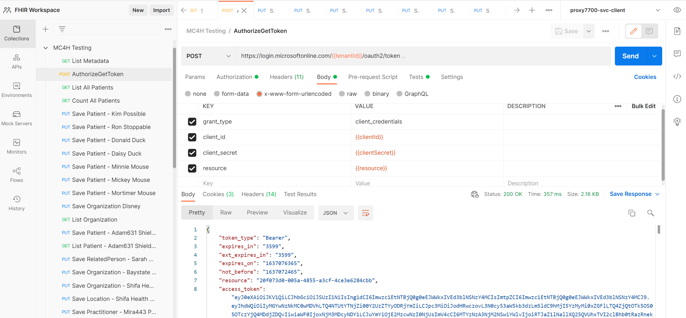

Select a Patient to test with - note the Patient ID - ensure you have a 200 OK return message from FHIR-Proxy 

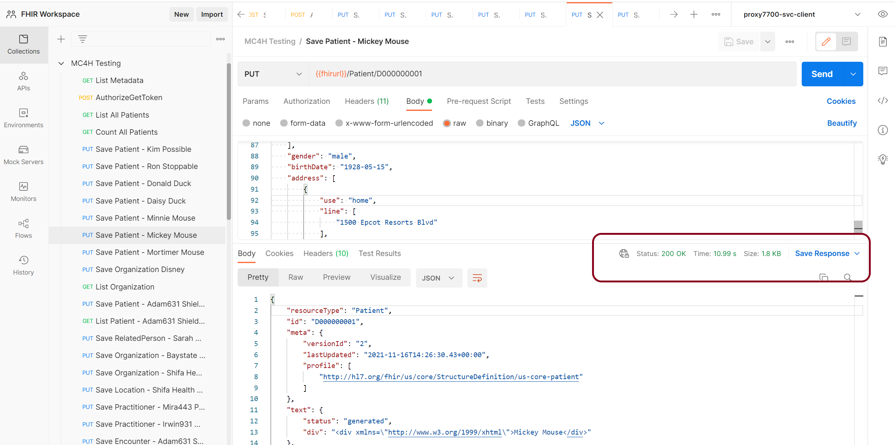


Check the Post Processor in FHIR-Proxy to ensure that it was successful 

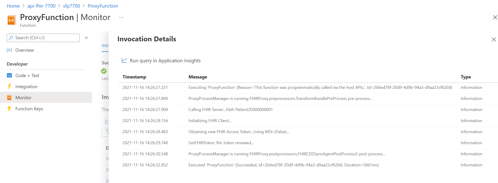


Check the FHIRUpdates Monitor 

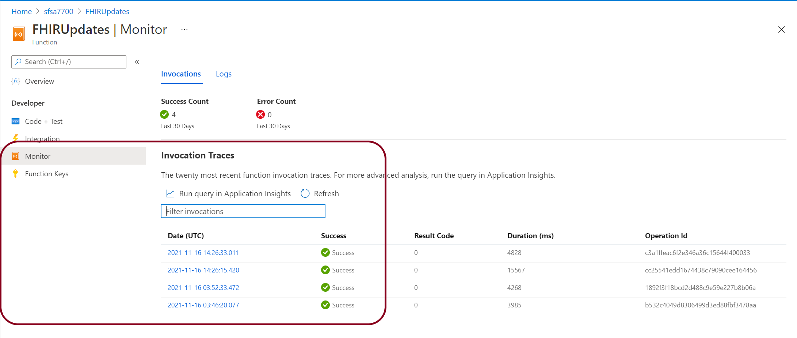

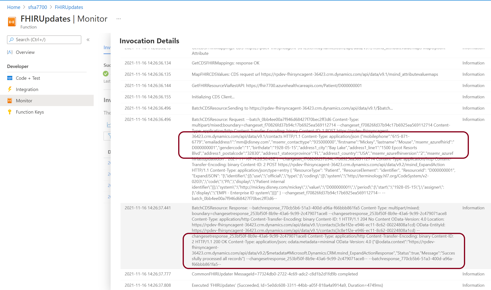


## Step 4 - Testing from FHIR-Loader (Challenge 3)
Testing from FHIR-Loader is similar to that of FHIR-Proxy, except that the FHIR Message format is different.  FHIR-Loader expects Bundle formatted messages

```al
{
  "resourceType": "Bundle",
  "type": "transaction",
  "entry": [
    {
      "fullUrl": "urn:uuid:67816396-e325-496d-a6ec-c047756b7ce4",
      "resource": {
        "resourceType": "Patient",
        "id": "67816396-e325-496d-a6ec-c047756b7ce4",
        "text": {
          "status": "generated",
          "div": "<div xmlns=\"http://www.w3.org/1999/xhtml\">Generated by <a href=\"https://github.com/synthetichealth/synthea\">Synthea</a>.Version identifier: v2.4.0-404-ge7ce2295\n .   Person seed: 5358307146659318376  Population seed: 0</div>"
        }
...
    }
  ]
}
``` 

Note the extra FHIR Resource of the Bundle and how items contained within it are "entrys" in an arrary. A bundle is similar to C-CDA in that it holds multiple entries about a patient. 

### FHIR-Loader Container (Challenge 3)

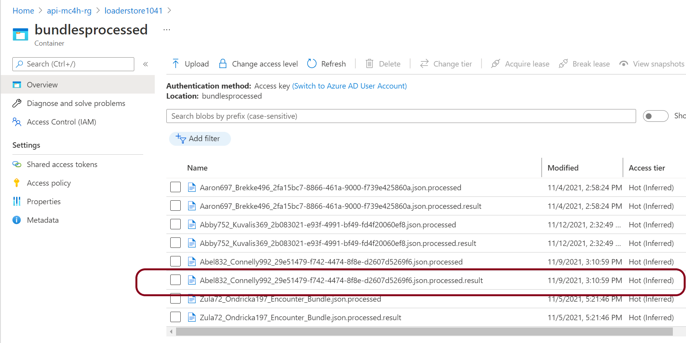

Find a ".result" file and select Edit or Download to review it.


Look for the RESTful Status 

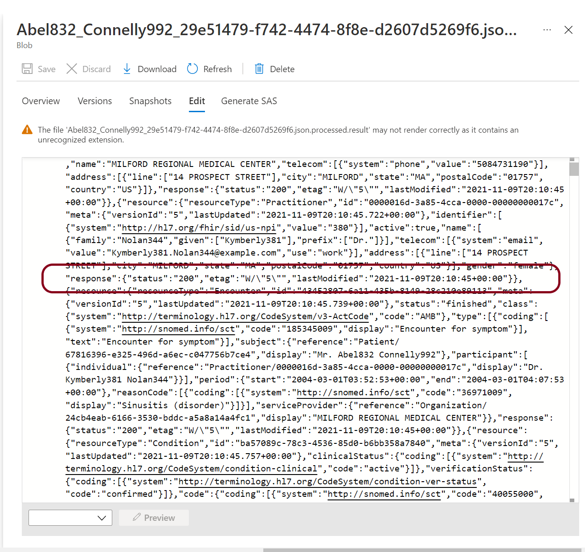

Same view in VS Code 

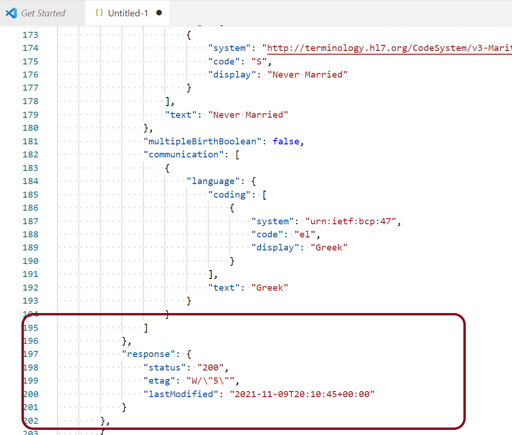
