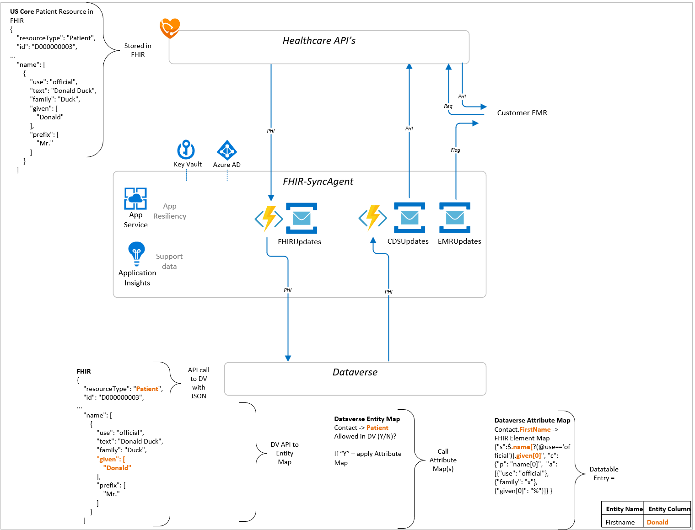
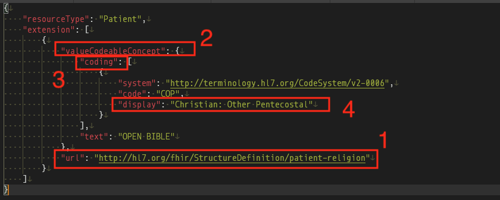
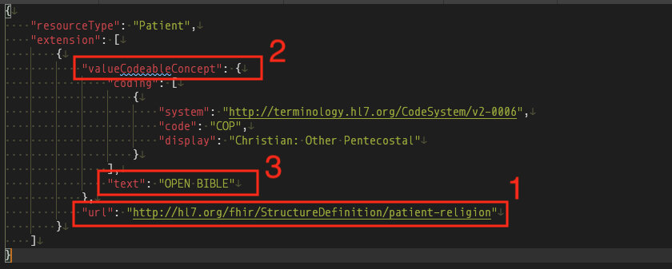

# Dataverse Entity and Attribute Mapping (Instructor Lead Training)

## Introduction

In this challenge you will learn about the data mapping that enables synchronization between Azure API for FHIR's data store and the Dataverse health data model.

## Background
The FHIR data store in Microsoft Cloud for Healthcare (MC4H) is **Azure API for FHIR**, while MC4H model-driven apps leverage the **Dynamics** health industry data model in **Dataverse**. Synchronizing data between FHIR and the Dataverse model requires several layers of mapping, most of which is set up and managed via the **SyncAdmin for FHIR** settings in Dynamics.

## Learning Objectives
+ Understand and Explain each layer of mapping
+ Test mapping between Azure API for FHIR and Dynamics 

---

## Step 1 - The Big Picture 
Flow from left to right... 

FHIR Resources (JSON Documents) are sent to Dataverse via the FHIR-SyncAgent. The parameter that determines which FHIR resources to send is the SA-FHIRMAPPEDRESOURCES variable set in Key Vault. To change the list of FHIR resources to send, a user/administrator needs to create a new Secret in Key Vault for themselves and then access and edit the SA-FHIRMAPPEDRESOURCES list values.

The FHIR-SyncAgent queries the Dataverse API to determine if the FHIR Resource (hereto "Resource") (ie Patient, Encounter, etc) should be sync’d with Dataverse. 

Dataverse uses two maps
- Entity Maps for matching Resources. If the Resource is Enabled in SyncAdministration, the data is parsed into Dataverse's Data model by the Attribute Maps. 
 
- Attribute Maps use JSONPath queries to map FHIR values to Table entries.   

Dataverse stores healthcare data in a relational model. The mappings above convert FHIR JSON documents to table entries.

The reverse follows the same pattern where Dataverse maps Entity Attributes back to FHIR via JSONPath queries. 




## Step 2 - Breaking down the Mapping Context
Mapping from FHIR to Dataverse begins with files coming into FHIR via FHIR-Proxy. Two App Configuration variables enable the mapping environment variable SA-FHIRMAPPEDRESOURCES 

__FHIR-Proxy Application Configuration__ values loaded by the SyncAgent Setup script. 

Name                               | Value                      | Located              
-----------------------------------|----------------------------|--------------------
SA-FHIRMAPPEDRESOURCES             | Static Resource List       | Keyvault reference 
FP-POST-PROCESSOR-TYPES            | Proxy Module               | App Service Config          

The current iteration of the FP-POST-PROCESSOR-TYPES is __FHIRProxy.postprocessors.FHIRCDSSyncAgentPostProcess2__


### Resources Enabled by Default

At this time there are two points / places to configure which Resources are sent to Dynamics

+ SA-FHIRMAPPEDRESOURCES
+ Entity Maps 

Resource default settings 

US Core R4 Resources | FHIR    | Dataverse
---------------------|---------|----------
Patient              | Enabled | Disabled 
Encounter            | Enabled | Disabled 
Device               | Enabled | Disabled 
Observation          | Enabled | Disabled 
Appointment          | Enabled | Disabled 
MedicationRequest    | Enabled | Disabled 
AllergyIntolerance   | Enabled | Disabled 
Procedure            | Enabled | Disabled 
Organization         | Enabled | Disabled  
Location             | Enabled | Disabled 
RelatedPerson        | Enabled | Disabled 
Claim                | Enabled | Disabled  
DiagnosticReport     | Enabled | Disabled  
Condition            | Enabled | Disabled  
Medication           | Enabled | Disabled 
CarePlan             | Enabled | Disabled  
Slot                 | Enabled | Disabled   
Schedule             | Enabled | Disabled   
CareTeam             | Enabled | Disabled  
Practioner           | Enabled | Disabled 

Users/admins **must** "Enable" Entity maps in Dataverse and then re-start the SyncAgent to enable data sync for the Resource(s). 

## Step 3 Understanding JSONPath 
Most issues with Mapping come from missing fields (ie why am I missing the name of this Encounter) which comes back to dicphering the JSON Path elements within the Attribute Maps.

Attribute mapping definitions are contained in a serialized JSON object. This object contains entries to support JSON Path selection for retrieving and updating existing property values as well as definitions for creating new JSON Properties on the FHIR Object that does not exist or needs to be inserted.
 

### JSON Object Definition
```al
{
	"s": "", //<A valid JSON Path expression used to select an existing JSON Property of the FHIR Resource to extract/set values from/to Dataverse,
	"c": { //<JSON property fields used  to insert/create JSON Properties when the select path is non-existent in the resource JSON Object >,
			"p": "", //<The parent JSON Property name to Create>.
			"a": [ //<Array of attributes to set on the selected JSON Property
				""
			]
}
```

### Examples

### Simple String Existing Field
The following would get a lastname from FHIR to send to Dataverse or update a lastname attribute value from Dataverse to FHIR:

```al
{"s": "$.name[?(@.use=='usual')].family"}
```

This mapping assumes that the node always exists and can be located via the JSON Path defined on the FHIR resource.

### Existing or Non-Existing Field
The following would get/update the city field of address[0] if it exists. If this was an update from Dataverse and address[0] did not exist, it would create an address[0] parent and set the city value from Dataverse. It would also create placeholder/default values for other attributes.

```al
{
	"s": "$.address[0].city",
	"c": {
		"p": "address[0]",
		"a": [
			{
				"line": ["x"]
			},
			{
				"city": "%"
			},
			{
				"state": "x"
			},
			{
				"postalCode": "x"
			},
			{
				"country": "x"
			}
		]
	}
}
```

__Note:__ For string values the value set is the literal defined in the attribute array unless it is one of the special character sequences. These will be replaced with values indicated below:
1. % - Copy the value of the Dataverse Attribute
2. %% -  Copy the type of the FHIR Reference Resource (e.g. Patient)
3. %%% - Copy the type and resource id of the FHIR Reference Resource (e.g. Patient/1234) 

### Patient Name 
Applying the rules above, we can use the following to:

- "s" =  extract a Patient given name to load into Dataverse
- "c" = create a Patient given name when not in FHIR
    - "p" = parent object of the entry to create
    - "a" = array parameters to use when creating "c"

```al
{"s": "$.name[?(@use=='official')].given[0]", "c": {"p": "name[0]",  "a": [{"use": "official"}, {"family": "x"}, {"given[0]": "%"}]} }
```

__Note__:  the brackets {} contain the expression, while the commas "," separate the expression segments, however the array bracket [] means the expression above contains 2 complete segments 

```al
"s": "$.name[?(@use=='official')].given[0]"
``` 
and

```al
"c": {"p": "name[0]",  "a": [{"use": "official"}, {"family": "x"}, {"given[0]": "%"}]
```

### Codeable Concpet
Matching Codeable Concepts is essentially the same as matching JSON string elements - the only difference being there is an additional level needed to get to the detail. 

1.	URL of the extension is http://hl7.org/fhir/StructureDefinition/patient-religion
2.	We want to access the valueCodeableConcept element inside this extension entry
3.	We want the first entry in the coding array
4.	We want to map the display to show the information in FHIR that is attached to a coding system

FHIR Resource 



JSON Path


### Text Example (religion)
1.	URL of the extension is http://hl7.org/fhir/StructureDefinition/patient-religion
2.	We want to access the valueCodeableConcept element inside this extension entry
3.	We want to map the text to show the information given to FHIR by Epic

FHIR Resource 



JSON Path


### Current Limitations
1. No dynamic array insertion/creation positions must be absolute, selection is dynamic using JSON Path
2. Value data must be valid in JSON for the destination attribute UTF-8 strings, JSON UTC Dates, booleans, etc...

# Tools
There are multiple tools that can be used to test JSON Path strings  
[JSONPath Online Evaluator](https://jsonpath.com) 
 
[JSON Escape / Unescape](https://codebeautify.org/json-escape-unescape) 

[JSON Path Extension for VSCodese](https://marketplace.visualstudio.com/items?itemName=weijunyu.vscode-json-path)

Read more here https://github.com/stedolan/jq/wiki/For-JSONPath-users 


