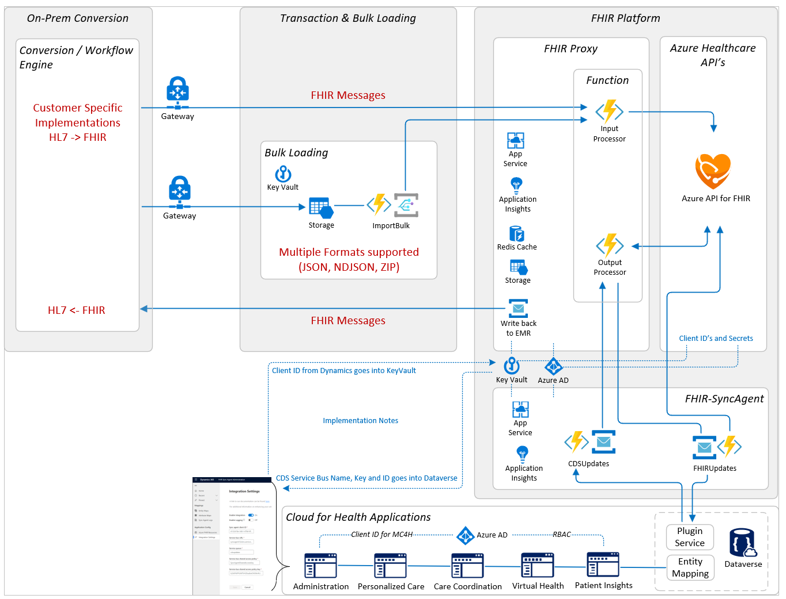
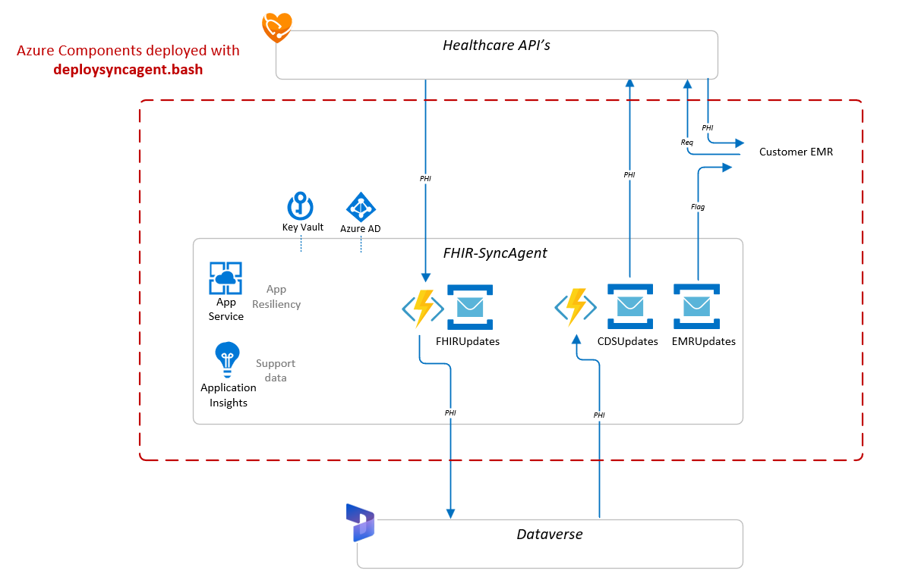
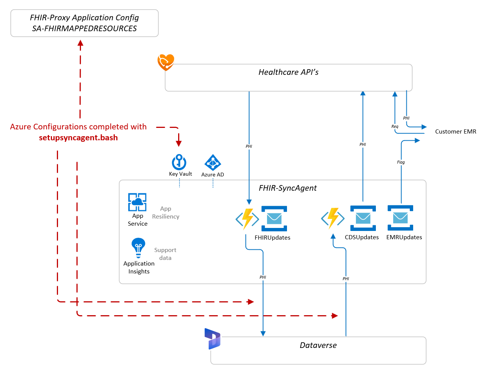
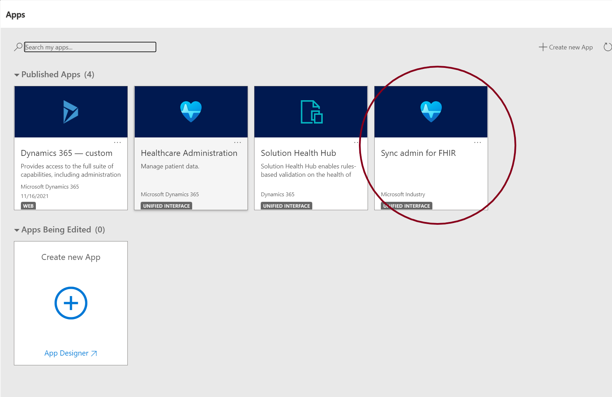
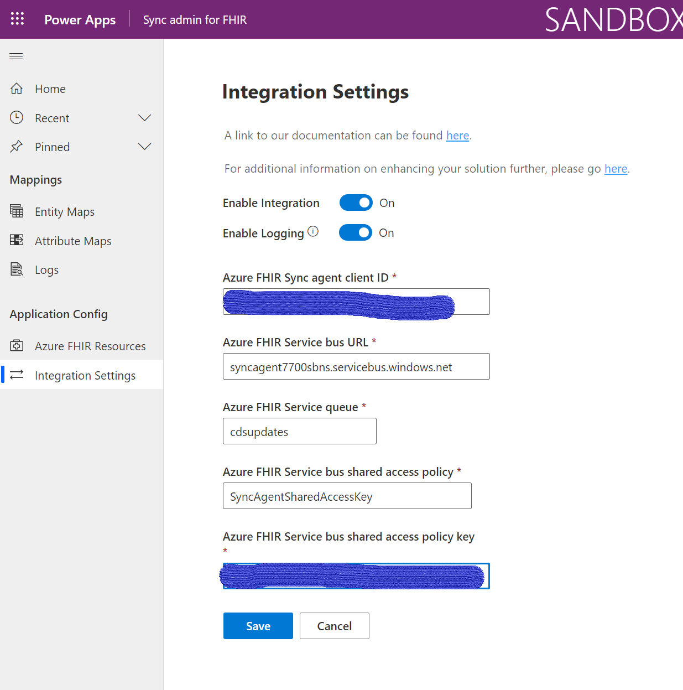

# Deployment & Data Flow Detail for the FHIR Sync Agent
## Background
FHIR data in MC4H is managed in the **Azure API for FHIR** data store, while MC4H model-driven apps are based on the **Dynamics** health industry data model in **Dataverse**. Leveraging Dataverse enables organizations to quickly stand up Power Apps for their unique needs. The FHIR-SyncAgent is a function app designed to keep data synchronized between the two data stores (Azure API for FHIR and Dataverse).  



## Sync Agent, API for FHIR and Dataverse Relationship 
The SyncAgent acts as a 2-way communication processor between Azure API for FHIR and Dataverse/Dynamics 365. 

FHIR Sync Agent includes two primary components:

1. **FHIR Sync Agent** service (Azure)
   * consists of Azure services that are deployed directly within your Azure Subscription
2. **Sync admin for FHIR application** (Power Platform Dataverse)
Both components are required in order for clinical information to properly flow between Azure API for FHIR and Dataverse.
   * deployed automatically when you deploy any of the Microsoft Cloud for Healthcare healthcare solutions through the Microsoft Cloud Solution Center

Installing the FHIR Sync Agent requires configuration in both Azure and Power Platform Dataverse.

## Deploying FHIR Sync Agent in Azure
Requirements in Azure (not all pictured below) include 
- FHIR-Proxy deployed with Azure API for FHIR
- Service Client information from the Dynamics Tenant (the Dynamics Tenant must be separate from the Azure API for FHIR/FHIR-Proxy tenant)
 For the Azure installation, two example .bash scripts are currently provided as a part of the [Azure FHIR Sync Agent](https://github.com/microsoft/fhir-cds-agent) OSS project, which do the following:<br>


<br>


> NOTE: The ```setupsyncagent.bash``` script outputs Service Bus Namespace and Queue information to be loaded into the Dynamics Sync Admin for FHIR application. This information is necessary for configuring the integration within the Power Platform Sync Admin for FHIR application. 
  

## Configuration in Sync Admin for FHIR Application 
Completing integration configuration in Power Platform Dataverse, requires 3 primary steps:
1. **Configure an App User** in Dataverse for the Service Client created in Challenge4. 
2. **Configure Sync Agent Integration** settings in the Sync Admin for FHIR app in Dataverse, 
3. **Enable default Entity and Attribute Maps** for transformation from FHIR to the CDM in Dataverse.

### Launching Sync Admin for FHIR Application
<br>
<center></center><br>

### Example Integration Settings page in Admin for FHIR Application
<br>
<center></center><br>

---
### Additional help and information:
* For detailed instructions on setting up and testing a write to Dataverse when new data flows into FHIR, see the **[Writing to Dataverse Detailed Instructions](../Docs/WritingToDataverseDetail.md) page**.
* For detailed instructions on how to work with Entity and Attribute maps, see the **[Dataverse Entity and Attribute Mapping](../Docs/ManageSyncAgentMaps.md)** page.
* For troubleshooting and maintenance information, see the **[Debugging, Operations and Maintenance](../Docs/Debug-Maintenance.md)** page.

