#  Writing FHIR Data to Dataverse Detailed Instructions

## Introduction

In this challenge you will learn more detail about writing data from Azure API for FHIR to Dataverse, and vice versa. 

## Background
The FHIR data store for Microsoft Cloud for Healthcare (MC4H) is **Azure API for FHIR**, while MC4H model-driven apps leverage the **Microsoft Common Data Model (CDM) for Health** data model in **Dataverse**. Synchronizing data between FHIR and the Dataverse CDM requires several layers of mapping, most of which is set up and managed via the **SyncAdmin for FHIR** settings in Dataverse.

## Learning Objectives
+ Synchronizing data between Azure API for FHIR and Dataverse  


## Prerequisites
Successful completion of all primary challenges:
* [Challenge0 - Pre-requisites](./Challenge0-Prerequistes/ReadMe.md)
* [Challenge1 - Deploy FHIR Components](./Challenge1-DeployFHIR/ReadMe.md)
* [Challenge2 - Configure Service Client Authorization](./Challenge2-AuthSetup/ReadMe.md)
* [Challenge3 - Bulk Load Synthea Data](./Challenge3-BulkLoad/ReadMe.md)
* [Challenge4 - Deploy FHIR Sync Agent](./Challenge4-FHIRSyncAgent/ReadMe.md)
* [Challenge5 - FHIR Sync to Dataverse Admin](./Challenge5-FHIRSyncDV/ReadMe.md)

---

## Step 1 - Configure Mapping on both Azure and Dataverse 

To begin, all Entity Maps are may be disabled by default. Customers must enable the ones equating to the FHIR Resources they wish to Sync with Dataverse. 

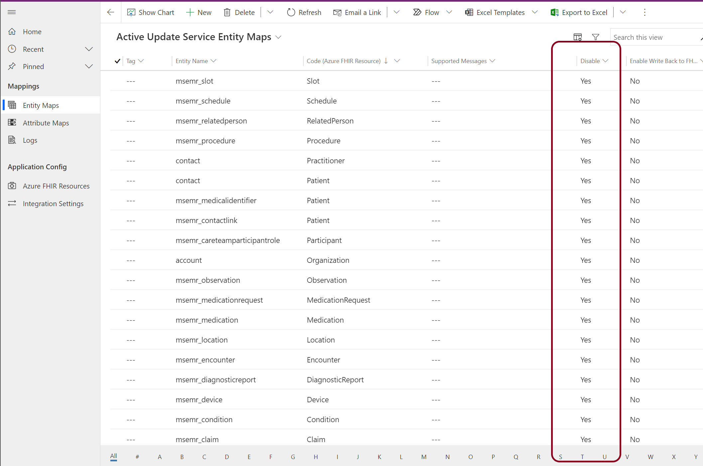


### Entity Expansion Maps

Entity expansion maps have been added for Appointment, Patient, and CareTeam

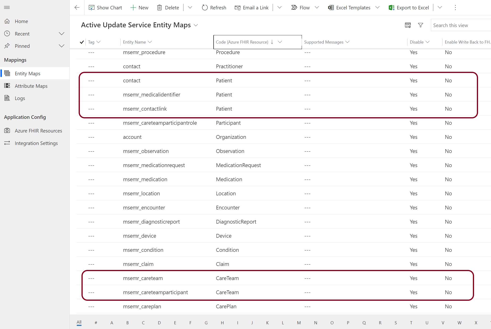


### Enable Patient 

Save & Close when finished.  

> NOTE: the expansion Attribute Maps are shown below 

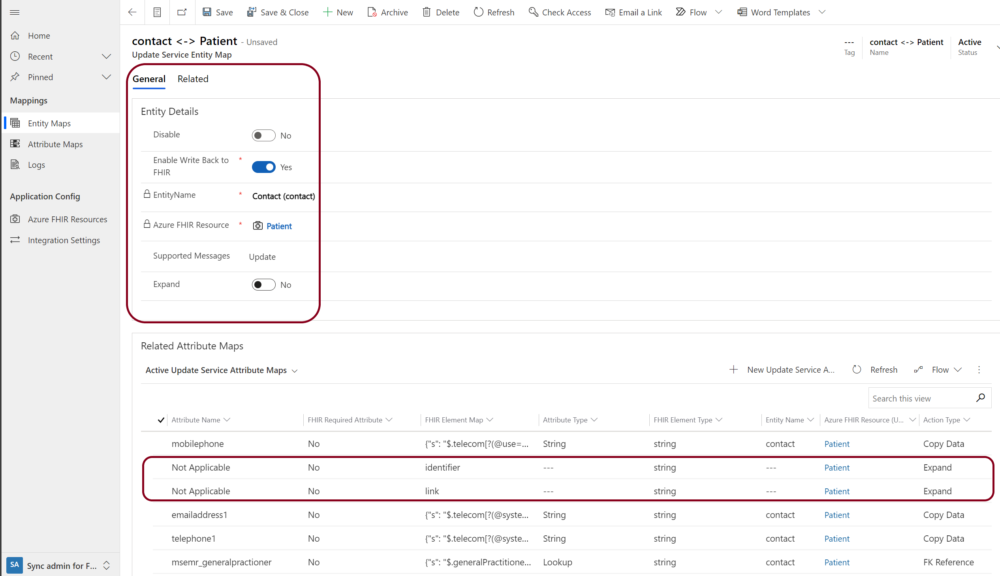

### Enable Patient -> Identifier Map

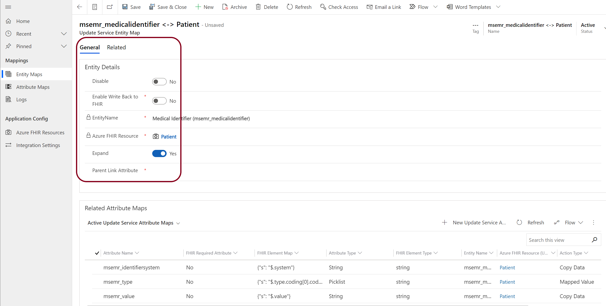


### Enable Patient -> Link Map

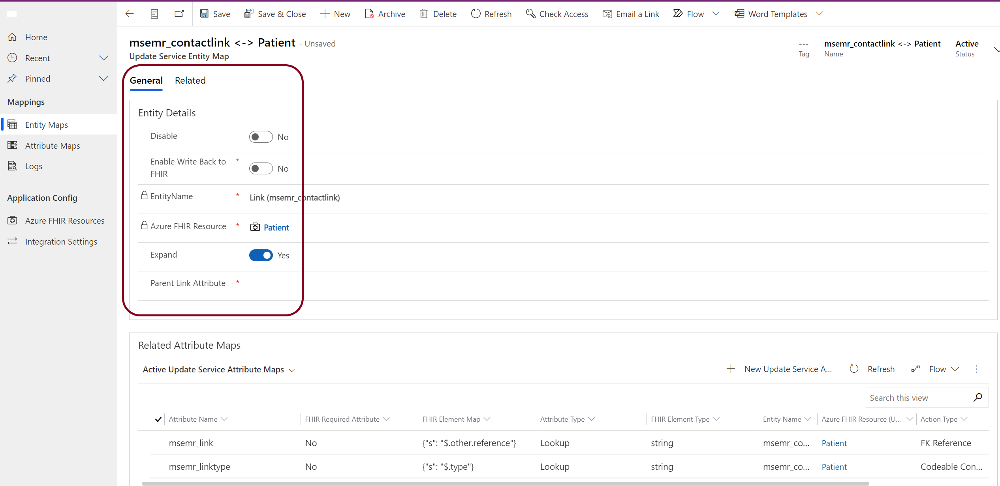

> **IMPORTANT! Restart the SyncApp to pickup Dataverse Changes**

## Step 2 Send a Patient to DV 
The best method for testing FHIR to Dataverse is to start with Postman.  **Remember** data that is in FHIR will not automatically be sync'd to Dataverse once an Entity is enabled; rather, the data must be *updated* in the FHIR server to trigger a sync. This is due to the trigger function in the FHIR-Proxy:

+ FHIR data enters the FHIR-Proxy either via Bundle or HTTPS
+ The FHIR-Proxy performs any Pre-Process task (ie converting a Transaction Bundle into a Batch Bundle)
+ The FHIR-Proxy Post-Process _FHIRProxy.postprocessors.FHIRCDSSyncAgentPostProcess2_ sends the MSG and Patient ID to the FHIR-SyncAgent for processing
+ The FHIR-SyncAgent calls the Dataverse API with the FHIR resource for processing 

You should have already loaded the MC4H Testing collection, here is the link again: [MC4H Testing.postman_collection.zip](./samples/MC4H_Testing.postman_collection.zip)  

The Patient Data in the MC4H Testing collection is structured in a way to help you track the users you create by ID.  In this example we are creating a Patient with a known ID that we can track.

```al
PUT {{fhirurl}}/Patient/D000000001
```
The JSON for Patient D000000001 is in the body of the Postman message (shortened for readability)

```al
{
    "resourceType": "Patient",
    "id": "D000000001",
    "meta": {
        "profile": [
            "http://hl7.org/fhir/us/core/StructureDefinition/us-core-patient"
        ]
    }
...
}
```

First, obtain a new Token from AAD.


Select a Patient to test with - note the Patient ID - ensure you have a 200 OK return message from FHIR-Proxy.


## Step 3 Check Dataverse
Login to Dataverse Sync admin for FHIR (Challenge 6), but switch to Healthcare Data.

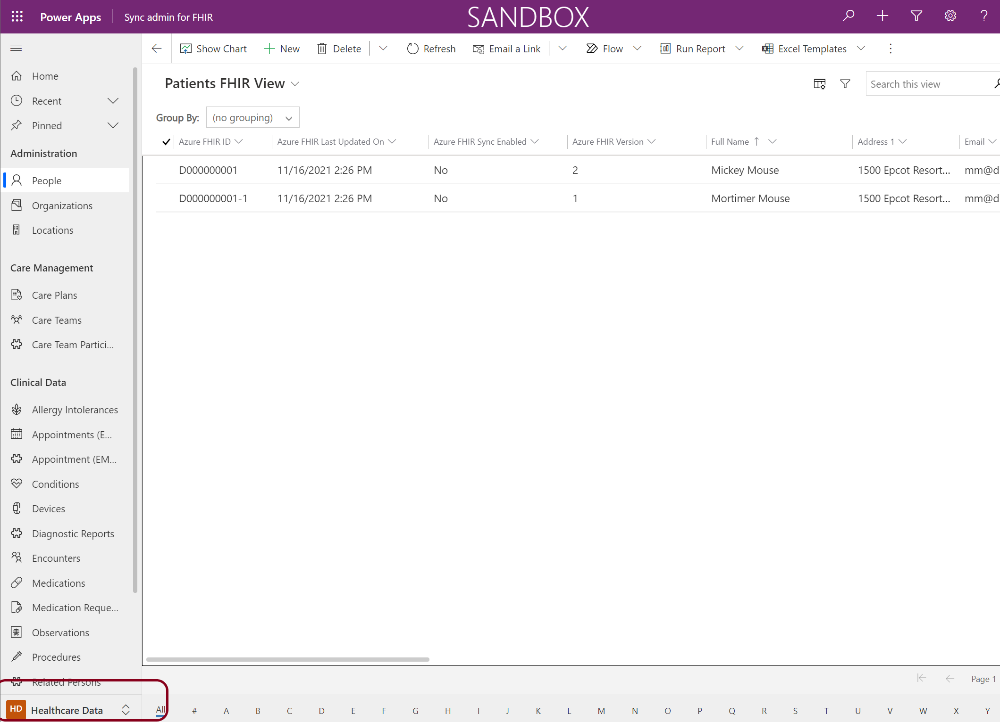

Note in this most recent release of MC4H a FHIR view has been added for the Resources in the left menu - the default screen is the Patient screen with FHIR View selected.

### Looking at Patient Details 
Each Patient Resource is represented by the business logic in the model app driving the Dataverse UI - meaning Patinets with Links as part of thir record will appear differently than Patients without.

The same happens with Identifiers (part of a Patient resource record). Here Donald has two Identifiers.

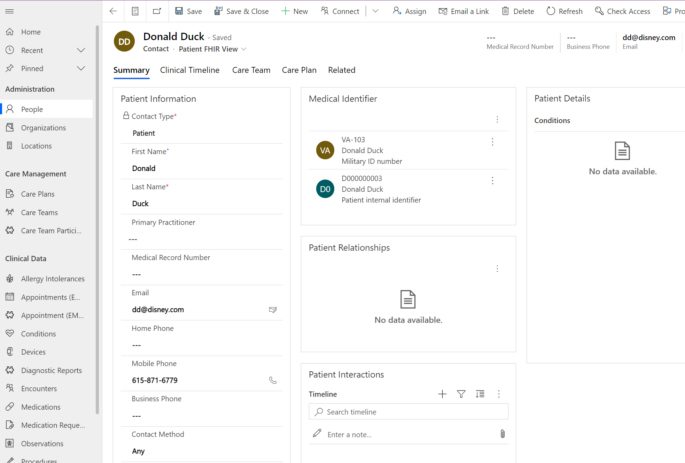

_Note_ There is missing information in Donald's record either because it was not supplied (which is the case here), because it is not aligned with US Core standards, or because the Attribute Map JSON parsing is incorrect.  More on this in the next challenge.

### Postman Scenario
For your convenience the Postman MC4H Collection is designed as a full scenario. Simply start at the top and work your way down through each entry to load both FHIR and Dataverse - __but wait__ - before you start loading data into FHIR, you must enable the following Dataverse Entities and Restart the SyncAgent to get that data into Dataverse.

**Enable** the following Entities in Dataverse (see above and below)

US Core R4 Resources | FHIR    | Dataverse
---------------------|---------|----------
Patient              | Enabled | Enable 
Encounter            | Enabled | Enable 
Device               | Enabled | Enable 
Observation          | Enabled | Enable 
Appointment          | Enabled | Enable 
MedicationRequest    | Enabled | Enable 
AllergyIntolerance   | Enabled | Enable
Procedure            | Enabled | Enable 
Organization         | Enabled | Enable 
Location             | Enabled | Enable 
RelatedPerson        | Enabled | Enable
Claim                | Enabled | Enable 
DiagnosticReport     | Enabled | Enable 
Condition            | Enabled | Enable 
Medication           | Enabled | Enable 
CarePlan             | Enabled | Enable 
Slot                 | Enabled | Enable 
Schedule             | Enabled | Enable 
CareTeam             | Enabled | Enable 
Practioner           | Enabled | Enable 

Once all Entities are enabled in Dataverse, your instance should look like this.  Note there are only a few Resources that should sync back to FHIR and a customer's EMR. 


**Restart** the SyncAgent

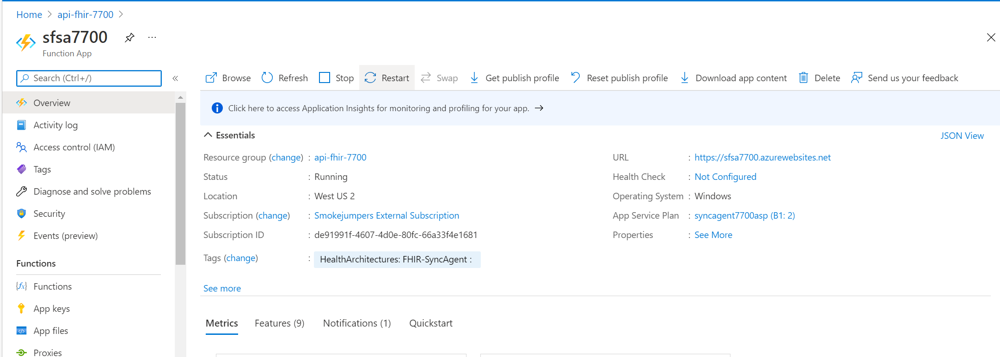


## Step 4 Writing data back to FHIR 
Our Patients are in Dataverse, so we have been able to write them as planned, so why does it show "No" Azure FHIR Sync Enabled?

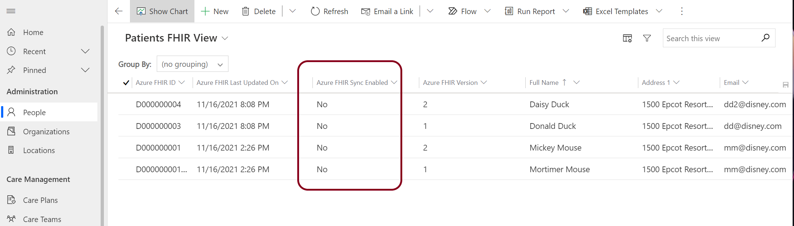


__Recall that Entities allow data in__.  If you want to send data back to FHIR, you have to enable the Sync at the individual Patient level. 

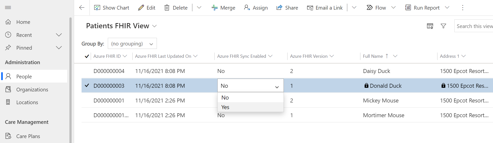

Here we have enabled Daisy and Donald for write back to FHIR.  

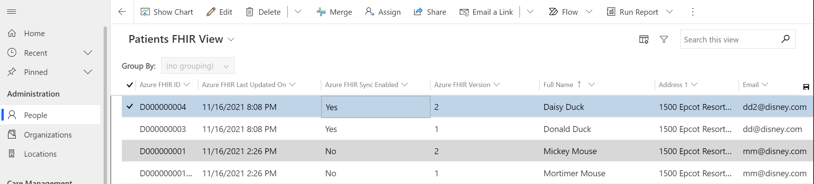

Lets change her mobile phone number to end in 0001 - then Save & Close.

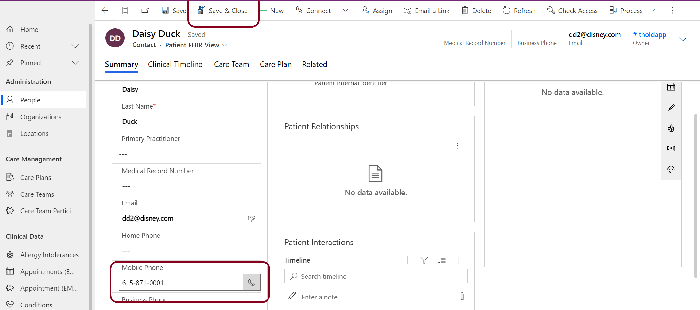


We can validate the change in FHIR by Listing All Patients and searching for Daisy, but that is rather inefficient.


The better approach is to search by Daisy's ID (D000000004) like this.

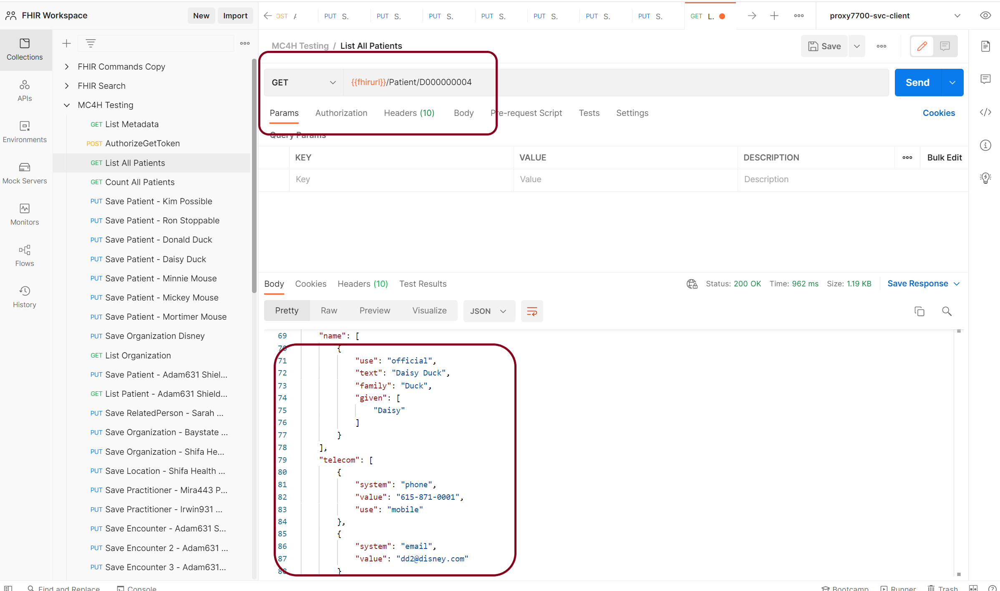
