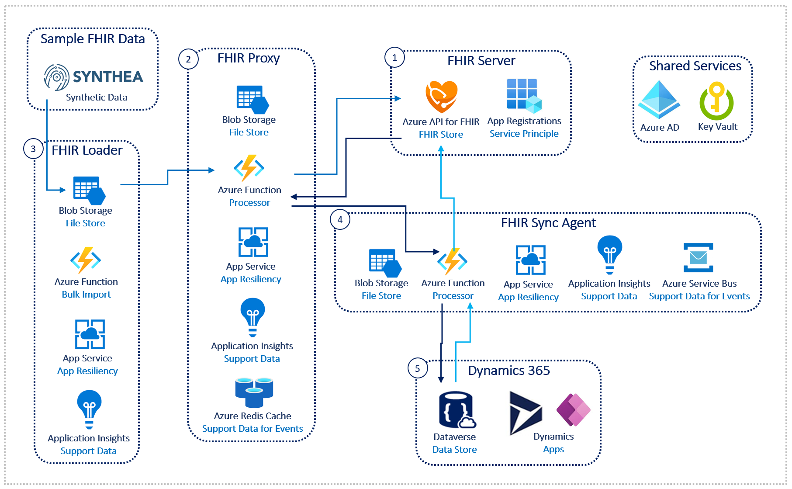

# FHIR for MC4H

#### This repository hosts the general guidance and reference architecture for delivering an OpenHack focused on FHIR for MC4H.

## Reference Architectures

## Contents

* [Challenge0 - Pre-requisites](./Challenge0-Prerequistes/ReadMe.md)
* [Challenge1 - FHIR Server](./Challenge1-FHIRServer/ReadMe.md)
* [Challenge2 - FHIR Proxy](./Challenge2-FHIRProxy/ReadMe.md)
* [Challenge3 - FHIR Loader](./Challenge3-FHIRLoader/ReadMe.md)
* [Challenge4 - FHIR Sync Agent](./Challenge4-FHIRSyncAgent/ReadMe.md)
* [Challenge5 - FHIR Sync to Dataverse in D365](./Challenge5-FHIRSyncDV/ReadMe.md)

***

[Go To Challenge0](./Challenge0-Prerequistes/ReadMe.md)
